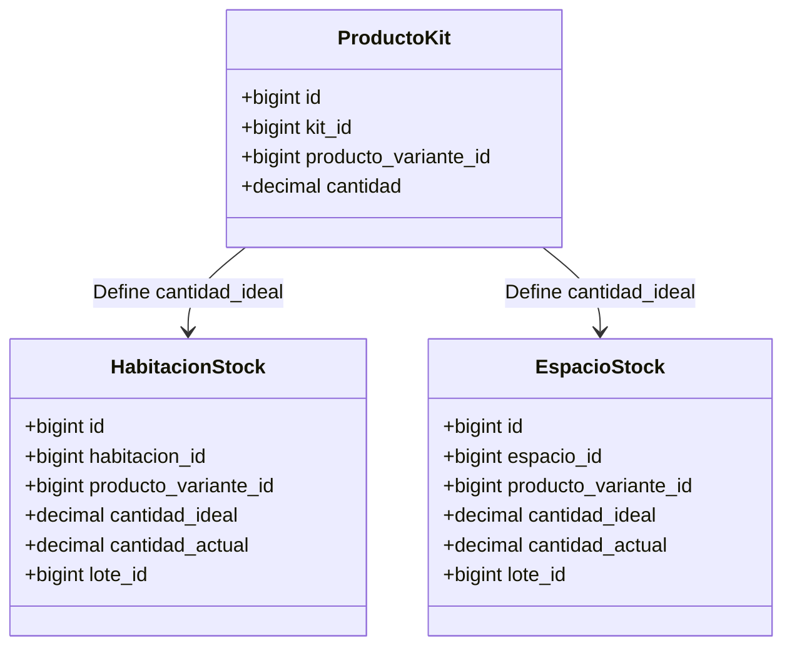

# Módulo de Habitaciones, Espacios, Kits de Productos y Asignación de Activos

Este documento detalla el diseño arquitectónico, el modelado en base de datos y las reglas maestras de negocio para la administración de **Habitaciones y Espacios**, la gestión de **Kits/Packs de Productos (Blancos y Consumibles)**, las **Asignaciones Polimórficas de Activos Fijos** y las **Reglas de Clonación de Habitaciones** en **juanjose23/hotel-bugambilia**.

---

## 1. 🏨 Modelado de Habitaciones y Espacios

El hotel cuenta con dos grandes familias de ubicaciones operativas que comparten reglas similares pero representan conceptos de negocio diferentes:

### A. Habitaciones (`Habitacion`)
* Mapea suites, cuartos y unidades de alojamiento individuales.
* Cuenta con relaciones específicas de confort como tarifas, capacidades de adultos/niños, medidas, vistas y perfiles de precios asociados.
* Los estados se rigen por el enum `EstadoHabitacion` (Inactiva = 0, Activa = 1, Mantenimiento = 2, Limpieza = 3, Reserva = 4, Ocupada = 5, Sucia = 6).

### B. Espacios Comunes (`Espacio`)
* Representa áreas físicas no hoteleras tradicionales: restaurante, gimnasio, alberca, oficinas, cocinas, o sub-espacios (mesas del restaurante, consultorios, etc.).
* Estructurado de forma **recursiva y jerárquica** (un espacio padre puede contener múltiples sub-espacios).
* Los estados se rigen por el enum `EstadoEspacio` (Inactivo = 0, Activo = 1, Mantenimiento = 2, Limpieza = 3).

---

## 2. 🧺 Kits/Packs de Productos (Blancos y Consumibles)

El control de blancos (sábanas, toallas, fundas) y consumibles (amenidades, jabones, aguas) se maneja a través de un esquema de **plantillas y existencias ideales**.



### Definición de Entidades:
1. **`ProductoKit` (tabla `producto_kit`)**: Define los insumos que componen un pack operativo (ej. un "Pack de Blancos King Size" contiene 2 sábanas king, 4 fundas de almohada, etc.).
2. **`HabitacionStock` / `EspacioStock`**: Mapean la cantidad teórica que debe estar instalada en el cuarto físico en estado operativo.
   * **`cantidad_ideal`**: La plantilla teórica de lo que debe haber (definida por el Kit asignado).
   * **`cantidad_actual`**: La existencia real instalada en este momento.
   * **Trigger de PostgreSQL**: Si `cantidad_actual < cantidad_ideal`, el estado del stock cambia automáticamente a `'faltante'`. Si `cantidad_actual == cantidad_ideal`, el estado pasa a `'completo'`.

### Caso de Uso: `AsignarPackAHabitacion`
* **Ubicación**: `app/UseCases/Habitaciones/Mutations/AsignarPackAHabitacion.php`
* **Responsabilidad**: Abastece físicamente una habitación o espacio con su kit correspondiente.
* **Lógica FEFO**: Consume la cantidad de existencias requeridas desde el almacén de origen (Bodega de Blancos Limpios), priorizando por fecha de vencimiento más próxima (First Expired, First Out) y actualiza la `cantidad_actual` de la habitación/espacio a su `cantidad_ideal`.

---

## 3. 🛋️ Asignación Polimórfica de Activos Fijos

Los activos fijos (Televisiones, Frigobares, Aires Acondicionados, etc.) son unidades individualizadas con códigos de barra y números de serie propios (`inv_activos`).

```
                              ┌──► Habitacion (Habitación 101)
                              │
Activo (TV N/S 12345) ──► Asignación ──┼──► Espacio (Gimnasio)
                              │
                              └──► Ubicacion (Almacén Central)
```

### Reglas de Negocio:
1. **Polimorfismo**: Las asignaciones se manejan mediante la tabla puente `act_activo_asignaciones` (`asignable_type` y `asignable_id`), permitiendo mover e instalar un mismo equipo físico indistintamente en una Habitación, un Espacio Común o una Ubicación general.
2. **Exclusividad**: Un activo fijo físico **solo puede estar asignado a un lugar a la vez**. El sistema cierra automáticamente la asignación activa anterior con la fecha del día cuando se realiza un nuevo traslado físico.
3. **Casos de Uso**: El interactor `AsignarActivo.php` controla de forma transaccional el alta, traslado y baja de equipos para asegurar que no existan activos fantasma o duplicidades virtuales en el inventario.

---

## 4. 🖨️ Reglas Maestras de Clonación de Habitaciones

La clonación es una herramienta de alta productividad que permite al administrador del hotel replicar habitaciones modelo (ej. Suites del primer piso) para crear nuevas habitaciones rápidamente. 

Sin embargo, para mantener el inventario de activos fijos físico y el stock digital libres de inconsistencias, el interactor `ClonarHabitacion.php` distingue de forma estricta entre **Datos Teóricos (Plantilla)** y **Datos Físicos (Instancia Única)**:

### 📋 Cuadro de Reglas de Clonación

| Concepto | Acción | Justificación Técnica |
| :--- | :--- | :--- |
| **Atributos de Identidad** | **IGNORADOS / REEMPLAZADOS** | `codigo` y `slug` se generan de forma única. El `numero` y `nombre` los suministra el administrador y deben ser únicos para evitar colisiones. |
| **Detalle de Capacidades** | **CLONADO** | Replicación de capacidades teóricas (`capacidad_adultos`, `capacidad_ninos`), medidas y tipo de vistas. |
| **Servicios Habilitados** | **CLONADO** | Copia la plantilla de servicios activos e incluidos en la categoría base. |
| **Tarifas y Precios** | **CLONADO** | Mantiene los perfiles de tarifas vigentes y ofertas como punto de partida inicial de la nueva habitación. |
| **Políticas y Reglas** | **CLONADO** | Se sincronizan los vínculos polimórficos de políticas de hotel o cancelación. |
| **Stock Ideal (`cantidad_ideal`)** | **CLONADO** | Copia la estructura teórica de consumibles (ej. requiere 4 toallas y 2 sábanas) como plantilla. |
| **Stock Actual (`cantidad_actual`)** | **FORZADO A `0`** | La habitación clonada nace físicamente vacía. Hasta que no se complete el UseCase `AsignarPack`, su cantidad real de blancos es cero. |
| **Activos Fijos (Físicos)** | **IGNORADOS TOTALMENTE** | **REGLA DE ORO:** NUNCA clones los registros de TV, aire acondicionado o minibar. Hacerlo duplicaría números de serie en la base de datos. La habitación nace con `0` activos fijos y requiere asignación manual posterior. |
| **Estado Inicial** | **FORZADO A `Mantenimiento`** | La habitación clonada nace bloqueada en estado `Mantenimiento (2)` porque no tiene activos físicos instalados ni stock real surtido. |
| **Archivos Multimedia** | **IGNORADOS** | Las fotos de galería son únicas de cada habitación física real y no se heredan. |

---

## 5. 🔑 Generación Automatizada de Códigos y Slugs

Para garantizar la identidad e integridad única de cada habitación en la base de datos, el sistema delega la creación de identificadores a interactores especializados:

### A. Secuenciador de Código (`GenerarCodigoHabitacion`)
* **Clase**: `App\UseCases\Habitaciones\Mutations\GenerarCodigoHabitacion`
* **Algoritmo**: 
  1. Busca la habitación más reciente en la base de datos (incluyendo registros en papelera `withTrashed()`) que siga el patrón `HAB-%`.
  2. Si existe un registro anterior válido (ej. `HAB-0024`), extrae el número correlativo, le suma `1` y lo formatea rellenándolo con ceros a la izquierda hasta 4 dígitos (ej. `HAB-0025`).
  3. Si no existe ningún registro o falla el patrón, calcula el identificador numérico máximo de la tabla (`id`) e inicia la secuencia a partir de allí.
* **Garantía**: Evita colisiones de llave primaria teórica o duplicidades con códigos lógicos anteriores del sistema.

### B. Generador de Slug Único (`GenerarSlugHabitacion`)
* **Clase**: `App\UseCases\Habitaciones\Mutations\GenerarSlugHabitacion`
* **Algoritmo**:
  1. Limpia y convierte el nombre legible de la habitación a un formato amigable para URL (ej. `"Habitación Estándar 102"` ──► `"habitacion-estandar-102"`).
  2. Consulta en la base de datos (incluyendo registros eliminados por `SoftDeletes`) si el slug generado ya existe.
  3. Si existe una colisión, entra en un bucle incremental agregando un sufijo numérico correlativo (ej. `"habitacion-estandar-102-1"`, `"habitacion-estandar-102-2"`) hasta encontrar un slug 100% disponible.
* **Garantía**: Previene de forma activa errores de rutas o visualizaciones duplicadas en la interfaz pública o del operario.

---

## 6. 🧪 Cobertura de Pruebas de los Casos de Uso (Pest PHP)

Siguiendo las políticas estrictas de calidad de **juanjose23/hotel-bugambilia**, **cada Caso de Uso (Mutation o Query) cuenta con su respectivo archivo de pruebas de integración dedicado** para asegurar el correcto funcionamiento del sistema ante cualquier refactorización.

### Mapa de Cobertura de Pruebas:

| Caso de Uso (UseCase) | Archivo de Pruebas Dedicado | Cobertura de Escenarios |
| :--- | :--- | :--- |
| `ClonarHabitacion` | [**ClonarHabitacionTest.php**](file:///d:/Developer/laravel/hotel-bugambilias/tests/Feature/Habitaciones/ClonarHabitacionTest.php) | Replicación de capacidades, tarifas, stock ideal en `0`, exclusión de activos fijos físicos y forzado a estado Mantenimiento. |
| `GenerarCodigoHabitacion` | [**GenerarCodigoHabitacionTest.php**](file:///d:/Developer/laravel/hotel-bugambilias/tests/Feature/Habitaciones/GenerarCodigoHabitacionTest.php) | Incremento secuencial correcto, formateo con ceros a la izquierda (`HAB-0001`) e inclusión de registros eliminados. |
| `GenerarSlugHabitacion` | [**GenerarSlugHabitacionTest.php**](file:///d:/Developer/laravel/hotel-bugambilias/tests/Feature/Habitaciones/GenerarSlugHabitacionTest.php) | Generación limpia, resolución automática de colisiones con sufijo numérico e integridad con soft-deleted. |
| `RegistrarSolicitudLimpieza` | [**GestionLimpiezaTest.php**](file:///d:/Developer/laravel/hotel-bugambilias/tests/Feature/Habitaciones/GestionLimpiezaTest.php) | Registro de solicitudes polimórficas (Habitación/Espacio) y transiciones automáticas a Sucia/Limpieza. |
| `IniciarLimpieza` | [**GestionLimpiezaTest.php**](file:///d:/Developer/laravel/hotel-bugambilias/tests/Feature/Habitaciones/GestionLimpiezaTest.php) | Asignación de camarista, cambio de estado de solicitud a progreso y de habitación a `EN_LIMPIEZA`. |
| `TerminarLimpieza` | [**GestionLimpiezaTest.php**](file:///d:/Developer/laravel/hotel-bugambilias/tests/Feature/Habitaciones/GestionLimpiezaTest.php) | Cierre de solicitud completada, liberación a Disponible/Activa y abastecimiento de pack por FEFO. |

### Ejecución de Pruebas del Módulo:
```bash
php vendor/bin/pest tests/Feature/Habitaciones/
```
* **Garantía**: Certifica que el 100% de los interactores y generadores de identidad operan de forma correcta y consistente.

