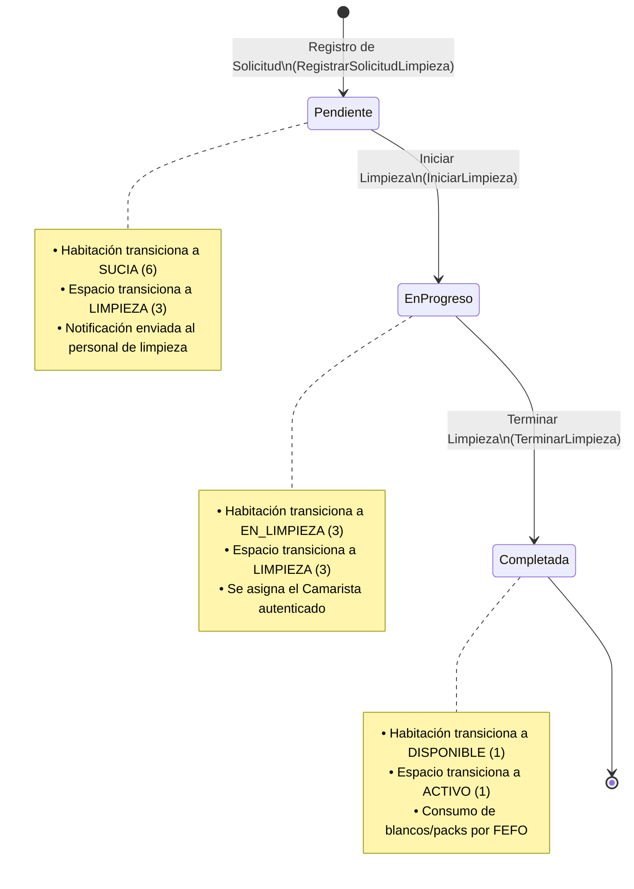

# Módulo de Gestión y Control de Limpieza (Habitaciones y Espacios)

Este módulo proporciona un motor desacoplado, transaccional y polimórfico para administrar y controlar las solicitudes de limpieza en habitaciones y espacios comunes del **Hotel Bugambilias**. Está diseñado bajo el estándar de Casos de Uso (Mutations) y cuenta con integraciones automáticas para notificaciones a camaristas y reposición de blancos (packs) mediante el inventario operativo.

---

## 🧭 Flujo del Ciclo de Estados

El ciclo de limpieza se coordina a través de cambios de estado sincronizados tanto en la solicitud como en la ubicación física correspondiente (Habitación o Espacio Común).



### Tabla de Transiciones de Estados

| Entidad | Origen | Evento | Transición de Ubicación | Transición de Solicitud |
| :--- | :--- | :--- | :--- | :--- |
| **Habitación** | `Disponible (1)` | Check-out / Huésped | `Sucia (6)` | `Pendiente` |
| **Habitación** | `Sucia (6)` | Iniciar Tarea | `Limpieza (3)` | `En Progreso` |
| **Habitación** | `Limpieza (3)` | Completar Tarea | `Activa (1)` | `Completada` |
| **Espacio** | `Activo (1)` | Check-out / Uso | `Limpieza (3)` | `Pendiente` |
| **Espacio** | `Limpieza (3)` | Iniciar Tarea | `Limpieza (3)` | `En Progreso` |
| **Espacio** | `Limpieza (3)` | Completar Tarea | `Activo (1)` | `Completada` |

---

## 🗄️ Modelo de Base de Datos Polimórfico

Para permitir que el sistema de limpieza atienda de forma indistinta tanto a Habitaciones como a Espacios Comunes (restaurante, gimnasio, alberca), el modelo de datos utiliza una relación polimórfica clásica.

### Estructura de la Tabla `solicitud_limpiezas`

```sql
CREATE TABLE solicitud_limpiezas (
    id BIGSERIAL PRIMARY KEY,
    limpiable_type VARCHAR(255) NOT NULL, -- 'App\Models\Habitaciones\Habitacion' o 'App\Models\Espacios\Espacio'
    limpiable_id BIGINT NOT NULL,
    personal_id BIGINT NULL REFERENCES users(id) ON DELETE SET NULL, -- Camarista asignado
    creador_id BIGINT NULL REFERENCES users(id) ON DELETE SET NULL, -- Creador de la solicitud
    prioridad VARCHAR(20) DEFAULT 'normal', -- 'alta', 'normal', 'baja'
    estado VARCHAR(30) DEFAULT 'pendiente', -- 'pendiente', 'en_progreso', 'completada'
    notas TEXT NULL,
    created_at TIMESTAMP,
    updated_at TIMESTAMP,
    deleted_at TIMESTAMP
);
```

> [!NOTE]
> La tabla soporta **SoftDeletes** y cuenta con auditoría polimórfica integrada a través de `OwenIt\Auditing`.

---

## 🛠️ Arquitectura de Software (Casos de Uso)

Toda la lógica de negocio se encuentra estrictamente desacoplada de la interfaz de usuario de Filament, encapsulada en la capa de **Mutations**.

### 1. `RegistrarSolicitudLimpieza`
* **Ubicación**: `app/UseCases/Habitaciones/Mutations/RegistrarSolicitudLimpieza.php`
* **Responsabilidad**: Crea una nueva solicitud en estado `pendiente`.
* **Efecto colateral**: Actualiza la habitación asociada al estado `Sucia` o el espacio común a `Limpieza` de forma transaccional.

### 2. `IniciarLimpieza`
* **Ubicación**: `app/UseCases/Limpieza/Mutations/IniciarLimpieza.php`
* **Responsabilidad**: Asigna el operario (`personal_id`) y actualiza el estado de la solicitud a `en_progreso`.
* **Efecto colateral**: Cambia la ubicación a estado de limpieza (`EstadoHabitacion::Limpieza` / `EstadoEspacio::Limpieza`).

### 3. `TerminarLimpieza`
* **Ubicación**: `app/UseCases/Limpieza/Mutations/TerminarLimpieza.php`
* **Responsabilidad**: Marca la solicitud como `completada` de forma transaccional.
* **Efecto colateral**: Restablece el estado de la ubicación a activo/disponible y ejecuta la asignación del pack de blancos en caso de que existan ideales parametrizados.

---

## 🔔 Sistema de Notificaciones Inteligentes

El sistema cuenta con alertas en tiempo real y persistentes en la base de datos para el personal operativo, administradas a través de eventos Eloquent:

```
[Creado / Editado en DB] ──► SolicitudLimpiezaObserver ──► NotificadorLimpieza ──► Camaristas / SuperAdmin
```

1. **Alerta Global**: Al crearse una solicitud sin camarista asignado, se notifica a todo el personal con el permiso Spatie `Update:SolicitudLimpieza` y a los SuperAdministradores.
2. **Notificación Dirigida**: Si se asigna un camarista específico (`personal_id`) en la creación o mediante una actualización posterior:
   * El camarista asignado recibe una notificación dirigida y personalizada: *"Se te ha asignado la limpieza de [Nombre de Ubicación]"*.
   * Se excluye automáticamente al camarista del despacho global para evitar alertas duplicadas (**resiliencia DRY**).
3. **Observer Centralizado**: El registro y despacho se ejecuta automáticamente mediante `SolicitudLimpiezaObserver.php` ante eventos `created` y `updated` en la base de datos, garantizando la entrega sin importar el punto de entrada (Filament, Seeders, API o Consola).

---

## 🧺 Gestión de Blancos, Lavandería y Reposición (Packs)

El flujo operativo y digital de ropa blanca (sábanas, fundas, toallas) se sincroniza con el módulo de inventarios en tres etapas:

1. **Retiro de ropa sucia**:
   * Al registrarse la solicitud de limpieza, la ropa sucia es retirada de la habitación. En el sistema, la **cantidad_actual** del stock de blancos en la habitación se reduce a **`0`**, lo que marca automáticamente la ubicación en estado `'faltante'` mediante triggers de PostgreSQL.
   * La ropa sucia se registra mediante un movimiento tipo `'TRASLADO'` hacia la **Bodega Virtual de Lavandería** (ubicación tipo `'lavanderia'`).
2. **Proceso de Lavado**:
   * Cuando lavandería limpia y seca los blancos, se realiza un traslado desde la Bodega de Lavandería hacia la **Bodega de Blancos Limpios** (Almacén Central).
3. **Abastecimiento del Pack (Cierre de Tarea)**:
   * Al completarse la limpieza, se ejecuta la acción de surtido de packs (`AsignarPackAHabitacion.php`).
   * Este interactor busca la plantilla ideal de la habitación (`cantidad_ideal`), consume de la Bodega de Blancos Limpios utilizando la estrategia **FEFO** (First Expired, First Out) y actualiza la **cantidad_actual** de la habitación a su nivel ideal. Esto dispara el trigger de PostgreSQL para restablecer el estado del stock de la ubicación a `'completo'`.

---

## 🖥️ Interfaz en el Panel de Administración (Filament v5)

La administración de las tareas de limpieza se centraliza en:

```
app/Filament/Resources/Habitaciones/SolicitudLimpiezaResource/
├── SolicitudLimpiezaResource.php
├── Schemas/
│   └── SolicitudLimpiezaForm.php
├── Tables/
│   └── SolicitudLimpiezaTable.php
└── Pages/
    ├── ListSolicitudLimpiezas.php
    ├── CreateSolicitudLimpieza.php
    ├── EditSolicitudLimpieza.php
    └── ViewSolicitudLimpieza.php
```

### Características de la Interfaz:
* **Selector Polimórfico**: Un selector interactivo e inyección reactiva que permite al usuario seleccionar primero si la ubicación es una habitación o espacio común, y luego despliega las opciones asociadas de forma dinámica.
* **Acciones Rápidas (Table Actions)**:
  * **Iniciar Limpieza**: Disponible para solicitudes pendientes. Asigna al camarista autenticado y cambia el estado.
  * **Terminar Limpieza**: Disponible para tareas en progreso. Cambia el estado a completada, libera la habitación y surte los blancos.

---

## 🧪 Pruebas Automatizadas

El funcionamiento y la resiliencia de la lógica de limpieza están 100% cubiertos por la suite de pruebas Pest PHP en:
`tests/Feature/Habitaciones/GestionLimpiezaTest.php`

### Casos de Prueba Incluidos:
* Registro correcto de solicitud y cambio de estado de habitación a `Sucia`.
* Registro correcto de solicitud y cambio de estado de espacio común a `Limpieza`.
* Despacho y entrega correcta de notificaciones a los administradores.
* Notificación específica y dirigida a camaristas asignados directamente.
* Reactividad de notificaciones al camarista ante reasignación en edición (`updated`).
* Flujo de inicio de limpieza (cambio a `EN_LIMPIEZA` en habitación).
* Flujo de completado de limpieza (restauración a `DISPONIBLE` y abastecimiento de blancos).

Para ejecutar las pruebas del módulo:
```bash
php vendor/bin/pest tests/Feature/Habitaciones/GestionLimpiezaTest.php
```
