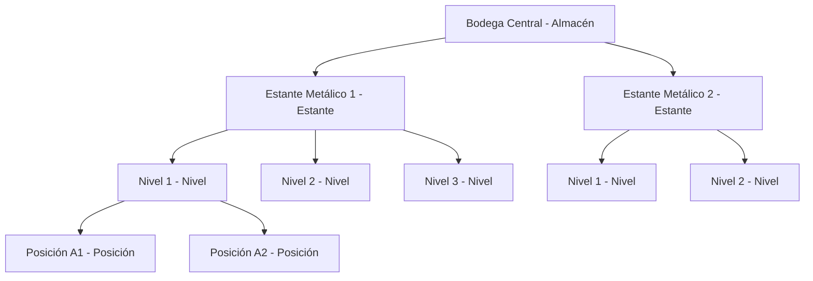
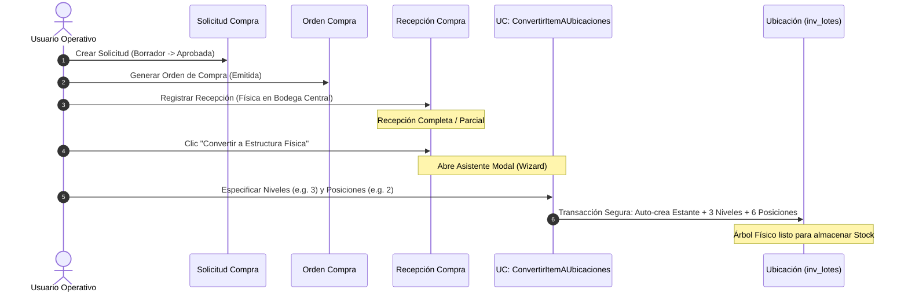

# Procesos: Ubicaciones Jerárquicas, Compras e Integridad Operativa
### Hotel Bugambilias

Este documento técnico detalla de forma autoritativa la arquitectura unificada y el flujo del sistema en relación a las **Ubicaciones Jerárquicas Recursivas**, el proceso de **Compra e Integración a Inventario (P2L)**, el mecanismo seguro de **Generación de Secuencias con Bloqueo de Base de Datos**, y los reportes de **Valorización Multi-Moneda**.

---

## 1. Arquitectura de Ubicaciones Recursivas (Sin Activos Fijos)

El Hotel Bugambilias ha eliminado por completo el uso de tablas separadas para "Activos Fijos" y "Almacenes/Zonas". En su lugar, utiliza un **modelo jerárquico recursivo unificado** dentro de la tabla `ubicaciones`. Cualquier estructura física donde se almacenen productos o que funcione como contenedor físico se modela como un nodo hijo autoreferenciado.

### 1.1 Diagrama de la Jerarquía Física Unificada



### 1.2 Modelado de Base de Datos (`ubicaciones`)

| Columna | Tipo | Nulabilidad | Descripción / Comentario |
| :--- | :--- | :--- | :--- |
| **id** | BIGINT (PK) | NOT NULL | Identificador único de la ubicación. |
| **padre_id** | BIGINT (FK) | NULLABLE | Referencia recursiva a `ubicaciones.id` (`null` = ubicación base). |
| **tipo** | VARCHAR(50) | NOT NULL | Tipo de contenedor físico (ej: `bodega`, `estante`, `nivel`, `posicion`, `edificio`, `zona`). |
| **nombre** | VARCHAR(150) | NOT NULL | Nombre identificador descriptivo (ej: "Estante 1"). |
| **descripcion**| TEXT | NULLABLE | Notas de uso o trazabilidad interna. |
| **orden** | INTEGER | NOT NULL | Ordenamiento correlativo dentro del mismo padre (Llave única compuesta `[padre_id, orden]`). |
| **estado** | INTEGER | NOT NULL | `1` = Activo, `0` = Inactivo, `3` = En Mantenimiento. |
| **deleted_at** | TIMESTAMP | NULLABLE | Borrado lógico (Soft Deletes). |

---

## 2. Flujo Completo: De Compras a Sub-Ubicaciones (P2L)



### 2.1 Fase 1: Creación de la Solicitud y Cotización
* Las solicitudes de compra (ej: *"Estante Metálico de 3 niveles"*) se inician en estado `Borrador` y avanzan a `En Revisión` y `Aprobada`.
* Se recopilan cotizaciones de múltiples proveedores (ej: Proveedor A cotiza a $120 c/u) y se selecciona la de mejor puntaje algorítmico.

### 2.2 Fase 2: Orden de Compra y Recepción Física
* Se emite la Orden de Compra (`OrdenCompra`) y se envía al proveedor.
* Al recibir el producto físicamente, se genera una `RecepcionCompra` vinculando la cantidad recibida contra la *"Bodega Central"* (Ubicación de Entrada sugerida por `PutawayPolicy`).

### 2.3 Fase 3: El Asistente de Conversión a Estructura
Si el producto comprado es convertible (funciona como contenedor físico), el operario presiona el botón **"Convertir a Estructura Física"** en la cabecera de la Recepción en Filament. 

El asistente auto-popula la información:
* **Producto seleccionado**: Estante Metálico.
* **Cantidad recibida**: 2 unidades.
* **Ubicación Padre**: Bodega Central (o cualquier otra área seleccionada).
* **Niveles por unidad**: 3 (por defecto).
* **Posiciones por nivel**: 2 (opcional).

### 2.4 Fase 4: Ejecución del Caso de Uso
El caso de uso `ConvertirItemAUbicaciones` realiza los insertos de forma secuencial en una única transacción de base de datos.
1. Crea la ubicación de tipo `estante` (ej: *"Estante Metálico 1"*) con su respectivo `padre_id` apuntando a la *Bodega Central*.
2. Crea los niveles hijos (ej: *"Nivel 1"*, *"Nivel 2"*, *"Nivel 3"*) con `padre_id` apuntando a la id del *"Estante Metálico 1"*.
3. Crea las sub-posiciones hijas (ej: *"Posición 1"*, *"Posición 2"*) con `padre_id` apuntando a cada nivel.

¡El almacén cuenta ahora de forma reactiva con sub-ubicaciones listas para almacenar otros insumos!

---

## 3. Generación Segura de Códigos con Bloqueo de Base de Datos

Para evitar la duplicación de códigos (ej: dos cotizaciones o recepciones con el mismo número secuencial en accesos concurrentes de múltiples operarios), el Hotel Bugambilias utiliza el patrón de **Generación de Secuencia con Bloqueo Pesimista** (`sharedLock` / `lockForUpdate`).

### 3.1 Mecanismo de Bloqueo y Generación de Código
Cada módulo operacional (Solicitudes, Cotizaciones, Órdenes, Recepciones) interactúa con una tabla central de secuencias o bien calcula el código mediante el siguiente algoritmo protegido en transacción:

```php
use Illuminate\Support\Facades\DB;

$codigo = DB::transaction(function () use ($tipoDocumento) {
    // 1. Obtener la secuencia actual bloqueando la fila para escritura
    $secuencia = DB::table('secuencias')
        ->where('tipo', $tipoDocumento)
        ->lockForUpdate() // BLOQUEO PESIMISTA
        ->first();

    $siguienteNumero = $secuencia ? $secuencia->ultimo_valor + 1 : 1;

    // 2. Actualizar el valor en la base de datos
    DB::table('secuencias')
        ->updateOrInsert(
            ['tipo' => $tipoDocumento],
            ['ultimo_valor' => $siguienteNumero, 'updated_at' => now()]
        );

    // 3. Formatear el prefijo operacional
    $prefijo = match ($tipoDocumento) {
        'solicitud' => 'SOL',
        'cotizacion' => 'COT',
        'orden_compra' => 'OC',
        'recepcion' => 'REC',
        default => 'DOC',
    };

    return sprintf('%s-%06d', $prefijo, $siguienteNumero);
});
```

> [!IMPORTANT]
> El uso de `lockForUpdate()` garantiza que si dos usuarios aprueban solicitudes simultáneamente, el segundo hilo esperará milisegundos en la base de datos a que el primero libere la transacción, impidiendo colisiones de códigos y saltos duplicados.

---

## 4. Gestión Multi-Moneda y Tasa de Cambio en Reportes

El Hotel Bugambilias opera de forma nativa en **Córdobas (NIO)** y **Dólares (USD)**. La tasa de cambio no se selecciona de forma arbitraria en cada compra; se maneja centralizadamente para garantizar la exactitud fiscal y contable.

### 4.1 Reglas de Conversión Financiera
1. **Moneda Base**: El sistema almacena todos los montos en la moneda de origen de la transacción.
2. **Historial de Tasas**: La tabla `tasas_cambio` almacena la tasa oficial diaria de conversión.
3. **Cálculo en Reportes**: 
   - Cuando compras en Córdobas pero deseas emitir un reporte valorizado en Dólares, el sistema busca la tasa de cambio correspondiente a la **fecha exacta de la transacción/recepción** (`fecha_recepcion` o `fecha`).
   - Si no existe una tasa específica para ese día, utiliza la tasa de cambio vigente más cercana para evitar discrepancias.

### 4.2 Ejemplo de Query de Conversión en Reporte Financiero (Valorización de Stock)
```sql
SELECT 
    l.codigo_lote,
    p.nombre AS producto,
    l.cantidad_disponible,
    oci.precio_unitario AS precio_costo_moneda_original,
    m.codigo AS moneda_compra,
    -- Conversión dinámica usando la tasa de cambio a la fecha de recepción:
    CASE 
        WHEN m.codigo = 'USD' THEN l.cantidad_disponible * oci.precio_unitario
        ELSE l.cantidad_disponible * (oci.precio_unitario / COALESCE(
            (SELECT tc.tasa FROM tasas_cambio tc 
             WHERE tc.fecha = l.fecha_recepcion 
               AND tc.moneda_origen_id = m.id 
               AND tc.moneda_destino_id = 2 -- ID de USD
             LIMIT 1), 
            36.50 -- Tasa de contingencia
        ))
    END AS valor_total_usd
FROM inv_lotes l
JOIN productos p ON p.id = l.producto_id
JOIN recepcion_items ri ON ri.id = l.recepcion_item_id
JOIN orden_compra_items oci ON oci.id = ri.orden_compra_item_id
JOIN monedas m ON m.id = oci.moneda_id;
```

---

## 5. Resumen de Ventajas Operativas

1. **Eficiencia en Base de Datos**: Cero redundancias de tablas físicas para activos fijos.
2. **Escalabilidad Sin Límites**: Permite modelar almacenes tan complejos como sea necesario (Pasillo ➔ Estante ➔ Nivel ➔ Caja ➔ Pallet).
3. **Trazabilidad de Auditoría Completa**: Al implementar `AuditableContract` y `SoftDeletes` en `Moneda` y `TasaCambio`, cualquier alteración del tipo de cambio histórico o monedas queda registrado con nombre de usuario, fecha y valores anteriores/posteriores.

---
*Documentación Oficial del Sistema de Gestión de Procesos — Hotel Bugambilias.*
