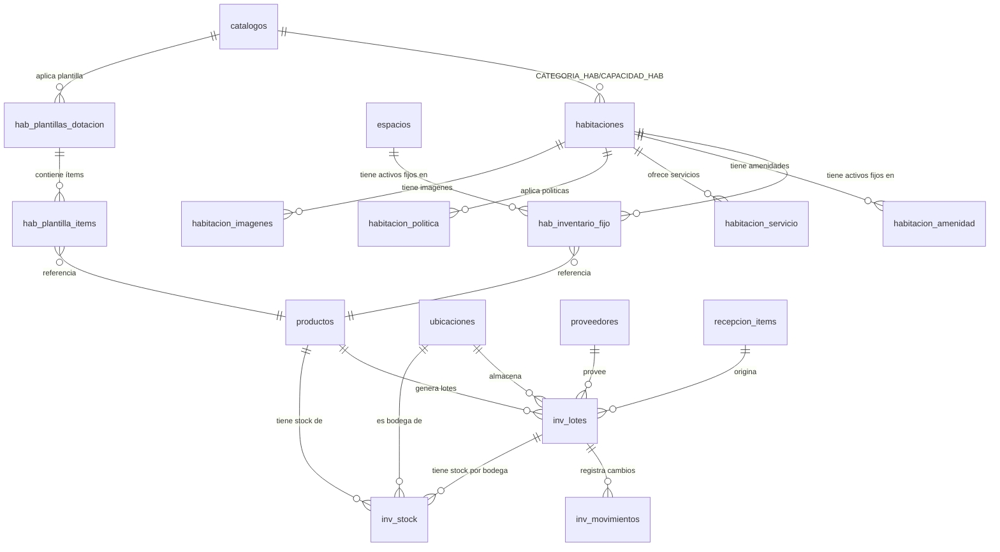

# Esquema de Base de Datos — Inventario v2.3

Este documento detalla el diseño físico-lógico completo de la base de datos del **Módulo de Inventario v2.3** del Hotel Bugambilias. Incluye todas las tablas activas, sus campos comentados, índices, restricciones y el orden correcto de migraciones.

> [!WARNING]
> **Las tablas `inv_modulos`, `inv_stock_ubicacion` e `inv_reservas` del v1 fueron eliminadas, junto con `inv_par_stock`, `inv_reposiciones` e `inv_reposicion_items` del v2.2.** No deben ser referenciadas en código nuevo. Ver la sección de tablas eliminadas al final de este documento.

---

## 🗺️ Diagrama Relacional (v2.3)



---

## 📋 CAPA 1 — Espacios Físicos

### 1.1 `habitaciones`
Registro de cada habitación física del hotel. El tipo de habitación se define mediante catalogos de tipo CATEGORIA_HAB y CAPACIDAD_HAB, eliminando la tabla hab_tipos_habitacion.

**Migración**: `2026_05_20_000001_create_habitacion_tables.php`
**Modelo**: `App\Models\Habitaciones\Habitacion`

| Campo | Tipo | Nulo | Por Defecto | Descripción |
| :--- | :--- | :---: | :--- | :--- |
| **id** | `bigint UNSIGNED` | No | Auto | Clave primaria autoincremental |
| **numero** | `varchar(10)` | No | — | Número de habitación (ej: `101`, `201A`). Único en la tabla |
| **categoria_id** | `bigint UNSIGNED` | No | — | FK → `catalogos` (CATEGORIA_HAB). Tipo de habitación (Estándar, Suite, Deluxe) |
| **capacidad_id** | `bigint UNSIGNED` | No | — | FK → `catalogos` (CAPACIDAD_HAB). Capacidad (Sencilla, Doble, Triple) |
| **capacidad_adultos** | `int` | No | `1` | Capacidad máxima de adultos |
| **capacidad_ninos** | `int` | No | `0` | Capacidad máxima de niños |
| **metros_cuadrados** | `int` | Sí | `NULL` | Metros cuadrados de la habitación |
| **piso** | `tinyint` | No | — | Número de piso donde se ubica |
| **ubicacion_id** | `bigint UNSIGNED` | Sí | `NULL` | FK → `ubicaciones` (nullOnDelete). Bodega de piso que surte consumibles |
| **estado** | `varchar(20)` | No | `disponible` | Estado operativo: `disponible`, `ocupada`, `mantenimiento`, `limpieza` |
| **activa** | `boolean` | No | `true` | Habilitada para operaciones |
| **created_at** | `timestamp` | Sí | `NULL` | Fecha de creación |
| **updated_at** | `timestamp` | Sí | `NULL` | Fecha de última modificación |

**Índices**:
- `PRIMARY KEY (id)`
- `UNIQUE (numero)`

---

### 1.2 `amenidades`
Catálogo de amenidades que puede tener una habitación (WiFi, TV, A/C, Secadora, etc.).

**Migración**: `2026_05_20_000001_create_habitacion_tables.php`
**Modelo**: `App\Models\Habitaciones\Amenidad`

| Campo | Tipo | Nulo | Por Defecto | Descripción |
| :--- | :--- | :---: | :--- | :--- |
| **id** | `bigint UNSIGNED` | No | Auto | Clave primaria |
| **nombre** | `varchar(255)` | No | — | Nombre de la amenidad |
| **icono** | `varchar(255)` | Sí | `NULL` | Icono o identificador visual |
| **categoria** | `varchar(255)` | Sí | `NULL` | Categoría: `baño`, `tecnología`, `habitación` |
| **created_at** | `timestamp` | Sí | `NULL` | |
| **updated_at** | `timestamp` | Sí | `NULL` | |

---

### 1.3 `servicios`
Catálogo de servicios ofrecidos por habitación (Desayuno, Parking, Shuttle, etc.).

**Migración**: `2026_05_20_000001_create_habitacion_tables.php`
**Modelo**: `App\Models\Habitaciones\Servicio`

| Campo | Tipo | Nulo | Por Defecto | Descripción |
| :--- | :--- | :---: | :--- | :--- |
| **id** | `bigint UNSIGNED` | No | Auto | |
| **nombre** | `varchar(255)` | No | — | Nombre del servicio |
| **descripcion** | `text` | Sí | `NULL` | |
| **created_at** | `timestamp` | Sí | `NULL` | |
| **updated_at** | `timestamp` | Sí | `NULL` | |

---

### 1.4 `politicas`
Catálogo de políticas de habitación (cancelación, check-in, mascotas, restricciones).

**Migración**: `2026_05_20_000001_create_habitacion_tables.php`
**Modelo**: `App\Models\Habitaciones\Politica`

| Campo | Tipo | Nulo | Por Defecto | Descripción |
| :--- | :--- | :---: | :--- | :--- |
| **id** | `bigint UNSIGNED` | No | Auto | Clave primaria |
| **tipo** | `varchar(255)` | No | — | Tipo: `cancelacion`, `check_in`, `mascotas`, `restriccion` |
| **titulo** | `varchar(255)` | No | — | Título de la política |
| **contenido** | `text` | No | — | Contenido detallado |
| **created_at** | `timestamp` | Sí | `NULL` | |
| **updated_at** | `timestamp` | Sí | `NULL` | |

---

### 1.5 `espacios`
Catálogo de espacios comunes del hotel — reemplaza hab_areas. Incluye salones, restaurantes, spas, gimnasios y áreas comunes.

**Migración**: `2026_05_20_000001_create_habitacion_tables.php`
**Modelo**: `App\Models\Espacios\Espacio`

| Campo | Tipo | Nulo | Por Defecto | Descripción |
| :--- | :--- | :---: | :--- | :--- |
| **id** | `bigint UNSIGNED` | No | Auto | Clave primaria autoincremental |
| **codigo** | `varchar(20)` | No | — | Código único (ej: `REST-1`, `SPA`). Único en la tabla |
| **nombre** | `varchar(100)` | No | — | Nombre descriptivo |
| **tipo** | `varchar(30)` | No | — | `salon`, `restaurante`, `spa`, `gimnasio`, `area_comun` |
| **capacidad** | `int` | Sí | `NULL` | Aforo máximo |
| **activa** | `boolean` | No | `true` | Habilitado para operaciones |
| **created_at** | `timestamp` | Sí | `NULL` | |
| **updated_at** | `timestamp` | Sí | `NULL` | |

**Índices**:
- `PRIMARY KEY (id)`
- `UNIQUE (codigo)`

---

### 1.6 Tablas Pivote (Habitación ↔ Amenidades/Servicios/Políticas)

Three pivot tables for many-to-many relationships:

**`habitacion_amenidad`**: (`habitacion_id` FK, `amenidad_id` FK) — PRIMARY KEY composite. `cascadeOnDelete`.
**`habitacion_servicio`**: (`habitacion_id` FK, `servicio_id` FK, `incluido` boolean default `true`) — PRIMARY KEY composite. `cascadeOnDelete`.
**`habitacion_politica`**: (`habitacion_id` FK, `politica_id` FK) — PRIMARY KEY composite. `cascadeOnDelete`.

---

### 1.7 `habitacion_imagenes`
Galería de imágenes de cada habitación.

**Migración**: `2026_05_20_000001_create_habitacion_tables.php`
**Modelo**: `App\Models\Habitaciones\ImagenHabitacion`

| Campo | Tipo | Nulo | Por Defecto | Descripción |
| :--- | :--- | :---: | :--- | :--- |
| **id** | `bigint UNSIGNED` | No | Auto | Clave primaria |
| **habitacion_id** | `bigint UNSIGNED` | No | — | FK → `habitaciones` (cascadeOnDelete) |
| **ruta** | `varchar(255)` | No | — | Ruta o URL de la imagen |
| **orden** | `int` | No | `0` | Orden de visualización |
| **created_at** | `timestamp` | Sí | `NULL` | |
| **updated_at** | `timestamp` | Sí | `NULL` | |

---

## 📋 CAPA 2 — Activos Fijos y Dotación

### 2.1 `hab_inventario_fijo`
Registra los **activos fijos** asignados permanentemente a habitaciones o áreas. Un activo fijo es cualquier bien que no se consume ni se retira en cada estadía: camas, televisores, aires acondicionados, refrigeradores, muebles, etc.

> **Regla de Negocio**: Los activos fijos nunca se rastrean en `inv_stock`. Viven en esta tabla y se gestionan mediante los casos de uso de Espacios.

**Migración**: `2026_05_20_000004_create_hab_inventario_fijo_table.php`
**Modelo**: `App\Models\Espacios\InventarioFijo`

| Campo | Tipo | Nulo | Por Defecto | Descripción |
| :--- | :--- | :---: | :--- | :--- |
| **id** | `bigint UNSIGNED` | No | Auto | Clave primaria autoincremental |
| **espacio_tipo** | `varchar(20)` | No | — | Tipo de espacio propietario: `habitacion` o `area`. Forma parte de la relación polimórfica simple |
| **espacio_id** | `bigint UNSIGNED` | No | — | ID del espacio propietario (habitación o área). Junto con `espacio_tipo` forma la relación |
| **producto_id** | `bigint UNSIGNED` | No | — | FK → `productos`. Producto/activo asignado (cascadeOnDelete) |
| **producto_variante_id** | `bigint UNSIGNED` | Sí | `NULL` | FK → `producto_variantes`. Variante específica del activo (nullOnDelete) |
| **cantidad** | `decimal(14,4)` | No | — | Cantidad de este activo asignada al espacio (ej: `2.0` sillas) |
| **estado** | `varchar(30)` | No | `operativo` | Estado del activo: `operativo`, `en_reparacion`, `dado_de_baja` |
| **notas** | `text` | Sí | `NULL` | Observaciones o notas sobre el estado del activo |
| **created_at** | `timestamp` | Sí | `NULL` | Fecha de asignación |
| **updated_at** | `timestamp` | Sí | `NULL` | Fecha de última modificación |
| **deleted_at** | `timestamp` | Sí | `NULL` | Borrado lógico (Soft Delete). Permite historial de activos retirados |

**Restricción Única**:
- `UNIQUE (espacio_tipo, espacio_id, producto_id, producto_variante_id)` — Solo puede haber una entrada por producto y espacio

---

### 2.2 `hab_plantillas_dotacion`
Define las **recetas de consumibles** que se deben preparar en una habitación o área. Cada plantilla describe qué productos consumibles se requieren y en qué cantidad.

**Migración**: `2026_05_20_000005_create_hab_plantillas_dotacion_table.php`
**Modelo**: `App\Models\Espacios\PlantillaDotacion`

| Campo | Tipo | Nulo | Por Defecto | Descripción |
| :--- | :--- | :---: | :--- | :--- |
| **id** | `bigint UNSIGNED` | No | Auto | Clave primaria autoincremental |
| **nombre** | `varchar(150)` | No | — | Nombre descriptivo de la plantilla (ej: `Dotación Estándar`, `Amenidades VIP`) |
| **espacio_tipo** | `varchar(20)` | No | — | Tipo de espacio al que aplica: `habitacion` o `area` |
| **tipo_id** | `bigint UNSIGNED` | Sí | `NULL` | FK sin constraint formal (nullOnDelete en lógica). ID del tipo de habitación que usa esta plantilla |
| **activa** | `boolean` | No | `true` | Solo las plantillas activas pueden aplicarse a través de `PrepararEspacio` |
| **notas** | `text` | Sí | `NULL` | Descripción extendida o instrucciones especiales para la preparación |
| **created_at** | `timestamp` | Sí | `NULL` | Fecha de creación |
| **updated_at** | `timestamp` | Sí | `NULL` | Fecha de última modificación |

---

### 2.3 `hab_plantilla_items`
Líneas de detalle de cada plantilla: qué producto, en qué cantidad y si se repone diariamente.

**Migración**: `2026_05_20_000005_create_hab_plantillas_dotacion_table.php` (misma migración)
**Modelo**: `App\Models\Espacios\PlantillaItem`

| Campo | Tipo | Nulo | Por Defecto | Descripción |
| :--- | :--- | :---: | :--- | :--- |
| **id** | `bigint UNSIGNED` | No | Auto | Clave primaria autoincremental |
| **plantilla_id** | `bigint UNSIGNED` | No | — | FK → `hab_plantillas_dotacion` (cascadeOnDelete) |
| **producto_id** | `bigint UNSIGNED` | No | — | FK → `productos`. Consumible requerido (cascadeOnDelete) |
| **producto_variante_id** | `bigint UNSIGNED` | Sí | `NULL` | FK → `producto_variantes`. Variante específica (nullOnDelete) |
| **cantidad** | `decimal(14,4)` | No | — | Cantidad del producto que se debe colocar por preparación |
| **es_reposicion_diaria** | `boolean` | No | `false` | Si `true`, el caso de uso `ReponerEspacio` incluirá este ítem en la reposición diaria automatizada |
| **created_at** | `timestamp` | Sí | `NULL` | Fecha de creación |
| **updated_at** | `timestamp` | Sí | `NULL` | Fecha de última modificación |

---

## 📋 CAPA 3 — Stock de Bodegas (Consumibles)

### 3.1 `inv_lotes`
Corazón operativo del control de inventario. Registra cada lote de mercancía recibida, su cantidad actual disponible y su fecha de vencimiento para la estrategia FEFO.

**Migración**: `2026_05_17_000002_create_inventarios_tables.php`
**Modelo**: `App\Models\Inventario\Lote`
**Factory**: `Database\Factories\Inventario\LoteFactory`

#### Generación del `codigo_lote`
El código del lote se genera automáticamente en `RegistrarEntradaRecepcion::execute()`:
```php
// Si el proveedor envió su propio número de lote, se usa ese.
// Si no, se genera automáticamente:
$codigoBase = $item['lote_proveedor']
    ?: sprintf('LOTE-%d-%s', $productoId, now()->format('Ymd'));

// Para recepciones con discrepancia, se agrega un sufijo:
// - Lote en estado Disponible: $codigoBase . '-DISP'
// - Lote en estado Cuarentena: $codigoBase . '-CUAR'
```

| Campo | Tipo | Nulo | Por Defecto | Descripción |
| :--- | :--- | :---: | :--- | :--- |
| **id** | `bigint UNSIGNED` | No | Auto | Clave primaria autoincremental |
| **codigo_lote** | `varchar(100)` | No | — | Código único del lote. Generado como `LOTE-{producto_id}-{Ymd}` o tomado del proveedor |
| **producto_id** | `bigint UNSIGNED` | No | — | FK → `productos` (cascadeOnDelete). Producto al que pertenece este lote |
| **producto_variante_id** | `bigint UNSIGNED` | Sí | `NULL` | FK → `producto_variantes` (nullOnDelete). Variante específica si aplica |
| **estado** | `tinyint / enum` | No | — | Estado del lote. Controlado por `App\Enums\Inventario\EstadoLote`: `Disponible`, `Cuarentena`, `Agotado`, `Vencido`, `Rechazado` |
| **cantidad_disponible** | `decimal(14,4)` | No | `0.0000` | Cantidad actual disponible para consumos. Se decrementa con cada consumo o traslado |
| **cantidad_inicial** | `decimal(14,4)` | No | `0.0000` | Cantidad original al momento de la recepción. No cambia después de la creación |
| **ubicacion_id** | `bigint UNSIGNED` | Sí | `NULL` | FK → `ubicaciones` (nullOnDelete). Almacén o bodega donde fue ubicado el lote inicialmente |
| **fecha_vencimiento** | `date` | Sí | `NULL` | Fecha de caducidad del lote. `NULL` para productos sin vencimiento. **Esencial para el algoritmo FEFO** |
| **lote_proveedor** | `varchar(100)` | Sí | `NULL` | Número de lote original del fabricante/proveedor. Permite trazabilidad con el proveedor |
| **proveedor_id** | `bigint UNSIGNED` | Sí | `NULL` | FK → `proveedores` (nullOnDelete). Proveedor del que se recibió este lote |
| **fecha_recepcion** | `date` | No | — | Fecha en que físicamente ingresó el lote al almacén del hotel |
| **recepcion_item_id** | `bigint UNSIGNED` | Sí | `NULL` | FK → `recepcion_items` (nullOnDelete). Ítem de recepción de compra que originó este lote |
| **created_at** | `timestamp` | Sí | `NULL` | Fecha de creación del registro |
| **updated_at** | `timestamp` | Sí | `NULL` | Fecha de última actualización |
| **deleted_at** | `timestamp` | Sí | `NULL` | Soft Delete. Lotes borrados lógicamente mantienen historial |

**Índices**:
- `inv_lotes_producto_id_estado_index (producto_id, estado)` — Agiliza búsquedas de lotes disponibles por producto (FEFO)
- `inv_lotes_estado_fecha_vencimiento_index (estado, fecha_vencimiento)` — Optimiza el barrido diario de caducidades (UC-04)

---

### 3.2 `inv_stock`
**Nueva tabla del v2.1.** Registra la existencia física de consumibles por producto, lote y bodega real. Reemplaza completamente a `inv_stock_ubicacion` del v1.

> **Principio fundamental**: Un registro en `inv_stock` existe solo mientras `cantidad > 0`. Cuando un consumo o traslado deja la cantidad en cero, el registro se elimina para mantener la tabla limpia.

**Migración**: `2026_05_20_000006_create_inv_stock_table.php`
**Modelo**: `App\Models\Inventario\Stock`

| Campo | Tipo | Nulo | Por Defecto | Descripción |
| :--- | :--- | :---: | :--- | :--- |
| **id** | `bigint UNSIGNED` | No | Auto | Clave primaria autoincremental |
| **producto_id** | `bigint UNSIGNED` | No | — | FK → `productos` (cascadeOnDelete). Producto del que se registra el stock |
| **producto_variante_id** | `bigint UNSIGNED` | Sí | `NULL` | FK → `producto_variantes` (nullOnDelete). Variante específica del producto |
| **lote_id** | `bigint UNSIGNED` | Sí | `NULL` | FK → `inv_lotes` (nullOnDelete). Lote al que pertenece esta existencia. Puede ser `NULL` para stock sin lote específico |
| **ubicacion_id** | `bigint UNSIGNED` | No | — | FK → `ubicaciones` (cascadeOnDelete). **Bodega física real donde está este stock**. Solo `tipo='almacen'` |
| **cantidad** | `decimal(14,4)` | No | `0.0000` | Cantidad disponible en esta bodega. Se elimina el registro cuando llega a cero |
| **created_at** | `timestamp` | Sí | `NULL` | Fecha de creación |
| **updated_at** | `timestamp` | Sí | `NULL` | Fecha de última modificación |

**Restricción Única**:
- `inv_stock_unique (producto_id, producto_variante_id, lote_id, ubicacion_id)` — Garantiza una sola fila por combinación de producto+variante+lote+bodega. Permite upserts seguros

**Índices**:
- `index (producto_id, ubicacion_id)` — Agiliza consultas de stock de un producto en una bodega específica

---

### 3.3 `inv_movimientos`
Bitácora histórica e inmutable de todas las transacciones de inventario. Cada cambio de stock debe registrar un movimiento aquí. Nunca se modifica ni se borra.

**Migración**: `2026_05_17_000002_create_inventarios_tables.php`
**Modelo**: `App\Models\Inventario\MovimientoStock`
**Factory**: `Database\Factories\Inventario\MovimientoStockFactory`

#### Tipos de Movimiento (`tipo`)

| Tipo | Descripción |
| :--- | :--- |
| `MOV_ENTRADA` | Ingreso de mercancía por recepción de compra |
| `TRASLADO` | Transferencia entre dos bodegas físicas |
| `SALIDA_DOTACION` | Consumo por preparación de habitación con plantilla |
| `REPOSICION_DIARIA` | Consumo por reposición diaria de amenidades |
| `DEVOLUCION_BODEGA` | Regreso de consumibles a la bodega de piso |
| `MOV_TRANSFERENCIA` | Traslado de cuarentena a almacén al liberar lote |
| `MOV_AJUSTE` | Ajuste de inventario por auditoría física |
| `AJUSTE_ENTRADA` | Excedente detectado en toma física de inventario |
| `AJUSTE_SALIDA` | Faltante detectado en toma física de inventario |
| `BAJA_CADUCIDAD` | Lote vencido enviado a merma automáticamente |
| `BAJA_CALIDAD` | Lote rechazado por inspección de calidad |
| `DEVOLUCION_PROVEEDOR` | Devolución de mercancía al proveedor |
| `CONSUMO` | Consumo general sin categoría específica |

| Campo | Tipo | Nulo | Por Defecto | Descripción |
| :--- | :--- | :---: | :--- | :--- |
| **id** | `bigint UNSIGNED` | No | Auto | Clave primaria autoincremental |
| **tipo** | `varchar(40)` | No | — | Tipo de movimiento. Ver tabla de tipos arriba |
| **lote_id** | `bigint UNSIGNED` | Sí | `NULL` | FK → `inv_lotes` (nullOnDelete). Lote involucrado en el movimiento |
| **producto_id** | `bigint UNSIGNED` | No | — | FK → `productos` (cascadeOnDelete). Producto del movimiento |
| **cantidad** | `decimal(14,4)` | No | — | Cantidad transaccionada. **Negativa para salidas**, positiva para entradas |
| **ubicacion_origen_id** | `bigint UNSIGNED` | Sí | `NULL` | FK → `ubicaciones`. Bodega de origen. `NULL` si es ingreso externo |
| **ubicacion_destino_id** | `bigint UNSIGNED` | Sí | `NULL` | FK → `ubicaciones`. Bodega de destino. `NULL` si es salida/consumo final |
| **documento_tipo** | `varchar(50)` | Sí | `NULL` | Tipo de documento soporte (ej: `recepcion_item`, `reposicion`, `devolucion`) |
| **documento_id** | `bigint UNSIGNED` | Sí | `NULL` | ID del documento soporte de este movimiento |
| **referencia** | `varchar(255)` | Sí | `NULL` | Glosa descriptiva del movimiento (ej: `"Lote LOTE-5-20260520 — Disponible"`) |
| **creado_por_id** | `bigint UNSIGNED` | Sí | `NULL` | FK → `users` (nullOnDelete). Usuario responsable del movimiento |
| **notas** | `text` | Sí | `NULL` | Observaciones adicionales o motivo del movimiento |
| **created_at** | `timestamp` | No | `useCurrent()` | Marca de tiempo inmutable del movimiento. No tiene `updated_at` |

> [!NOTE]
> El modelo tiene `public $timestamps = false` y `created_at` está en `$fillable`. Esto permite establecer la fecha de creación manualmente en importaciones o migraciones de datos, pero en uso normal se establece automáticamente.

**Índices**:
- `inv_movimientos_producto_id_created_at_index (producto_id, created_at)` — Para reportes de rotación e historial de consumo

---

### 3.4 `inv_inventarios_fisicos`
Registro de las tomas periódicas de inventario físico para auditorías y corrección de discrepancias entre el stock lógico y el real.

**Migración**: `2026_05_18_000003_create_inventarios_fisicos_table.php`
**Modelo**: `App\Models\Inventario\InventarioFisico`

#### Generación del `codigo`
El código del inventario físico se genera manualmente por el operador o mediante el formulario de Filament, siguiendo el formato sugerido `INV-FIS-{Ymd}`.

| Campo | Tipo | Nulo | Por Defecto | Descripción |
| :--- | :--- | :---: | :--- | :--- |
| **id** | `bigint UNSIGNED` | No | Auto | Clave primaria autoincremental |
| **codigo** | `varchar(100)` | No | — | Folio único de control de la auditoría (ej: `INV-FIS-20260520`) |
| **fecha_toma** | `date` | No | — | Fecha en que se realizó el conteo físico |
| **estado** | `varchar(40)` | No | `borrador` | Estado: `borrador` (editable) o `procesado` (bloqueado, ajustes aplicados) |
| **creado_por_id** | `bigint UNSIGNED` | Sí | `NULL` | FK → `users` (nullOnDelete). Auditor responsable |
| **observaciones** | `text` | Sí | `NULL` | Notas del auditor sobre el conteo |
| **datos_hoja** | `longtext` | Sí | `NULL` | JSON con los conteos físicos capturados: `[{lote_id, cantidad_contada}]` |
| **created_at** | `timestamp` | Sí | `NULL` | Fecha de creación |
| **updated_at** | `timestamp` | Sí | `NULL` | Fecha de última modificación |
| **deleted_at** | `timestamp` | Sí | `NULL` | Soft Delete |

---

## 🗓️ Orden de Migraciones

El orden de aplicación es crítico por las dependencias de llaves foráneas:

```
PREEXISTENTES (deben existir antes del módulo de inventario):
  ├── ubicaciones          (2026_05_06_182350)   → tabla base para almacenes/bodegas
  ├── productos            (2026_05_10_080909)   → catálogo de productos
  ├── producto_variantes   (2026_05_10_231842)   → variantes de productos
  └── recepciones_compra   (2026_05_12_000006)   → recepciones del módulo de compras

INVENTARIO — NÚCLEO:
  ├── inv_lotes + inv_movimientos    (2026_05_17_000002)
  └── inv_inventarios_fisicos        (2026_05_18_000003)

ESPACIOS FÍSICOS Y CATÁLOGOS (nuevo v2.1):
  ├── amenidades + servicios + politicas +
  │   habitaciones + espacios + pivotes +
  │   habitacion_imagenes                (2026_05_20_000001)
  ├── ADD categoria_id a plantillas;
  │   UPDATE espacio_tipo area → espacio  (2026_05_20_000002)
  ├── hab_inventario_fijo                (2026_05_12_000004) -- unchanged
  └── hab_plantillas_dotacion +
      hab_plantilla_items                (2026_05_12_000005)+
                                          (2026_05_12_000006) -- unchanged

STOCK DE BODEGAS (nuevo v2.1):
  └── inv_stock                      (2026_05_20_000006)

RECONSTRUCCIÓN v1 → v2.1:
  └── DROP inv_reservas, inv_stock_ubicacion, inv_modulos
```

---

## 🌱 Seeders y Orden de Inicialización

```bash
# Orden de ejecución requerido por dependencias
php artisan migrate:fresh --seed

# O manualmente por seeder:
php artisan db:seed --class=Database\\Seeders\\UbicacionSeeder       # 1. Crea Almacén General
php artisan db:seed --class=Database\\Seeders\\ProductoSeeder        # 2. Productos del hotel
php artisan db:seed --class=Database\\Seeders\\ProveedorSeeder       # 3. Proveedores
php artisan db:seed --class=Database\\Seeders\\HabitacionSeeder      # 4. Habitaciones, amenidades, servicios, políticas, espacios
php artisan db:seed --class=Database\\Seeders\\InventarioSeeder      # 5. Lotes y stock inicial
```

### `UbicacionSeeder`
Inserta la ubicación raíz del almacén:
```php
Ubicacion::create([
    'nombre' => 'Almacén General',
    'tipo'   => 'almacen',   // ← Clave: PutawayPolicy busca tipo='almacen'
    'estado' => 1,           // ← Activo
]);
```
> [!IMPORTANT]
> El **Almacén General** debe tener `tipo = 'almacen'` y `estado = 1`. `PutawayPolicy` busca específicamente esta configuración para asignar inventario recibido.

### `HabitacionSeeder`
Inserta datos demo del módulo de habitaciones:
- 2 registros en catalogos (CATEGORIA_HAB, CAPACIDAD_HAB)
- 3 habitaciones (101 Estándar Doble, 102 Estándar Doble, 201 Suite Sencilla)
- 6 amenidades (WiFi, TV, A/C, Secadora, Caja Fuerte, Balcón)
- 4 servicios (Desayuno, Estacionamiento, Transporte Aeropuerto, Lavandería)
- 3 políticas (Cancelación, Check-in, No Fumar)
- 2 espacios (Restaurante Principal, Spa)
- Pivotes de amenidades/servicios/políticas para cada habitación

### `InventarioSeeder`
Genera lotes iniciales de stock del hotel vinculados al Almacén General, registrando los movimientos de `MOV_ENTRADA` correspondientes y poblando `inv_stock` con las existencias iniciales.

---

## ❌ Tablas Eliminadas (v1 y v2.2 — NO USAR)

Las siguientes tablas existieron en versiones anteriores y fueron eliminadas. **No deben ser referenciadas en ningún código nuevo.**

| Tabla | Por qué existía | Por qué se eliminó |
| :--- | :--- | :--- |
| **`hab_tipos_habitacion`** | Catálogo de tipos de habitación con campos fijos | Reemplazado por catalogos (`CATEGORIA_HAB` + `CAPACIDAD_HAB`) más flexibles. Eliminada en `2026_05_20_000002` |
| **`hab_habitaciones`** | Registro de habitaciones con FK a `hab_tipos_habitacion` | Reemplazada por nueva tabla `habitaciones` con `categoria_id`/`capacidad_id` a catalogos. Eliminada en `2026_05_20_000002` |
| **`hab_areas`** | Catálogo de áreas comunes (salones, restaurantes) | Reemplazada por `espacios`. Eliminada en `2026_05_20_000002` |
| **`inv_modulos`** | Sub-almacenes polimórficos (minibares, carritos) ligados a habitaciones/salones | Concepto erróneo: mezclaba camas, TVs y champús en el mismo modelo |
| **`inv_stock_ubicacion`** | Distribución física de stock con campo `ambito` (`H`, `S`, `U`, `M`) | Reemplazado por `inv_stock` que solo usa bodegas reales (`ubicaciones` tipo `almacen`) |
| **`inv_par_stock`** | Configuración PAR (mínimos/objetivo) para reposición automática | Módulo de reposiciones removido en v2.3 |
| **`inv_reposiciones`** | Cabecera de órdenes de reabastecimiento entre bodegas | Módulo de reposiciones removido en v2.3 |
| **`inv_reposicion_items`** | Líneas de detalle de cada orden de reposición | Módulo de reposiciones removido en v2.3 |
| **`inv_reservas`** | Aislamiento temporal de stock para prevenir consumos concurrentes | El nuevo flujo de dotación por plantilla elimina la necesidad de reservas temporales |
