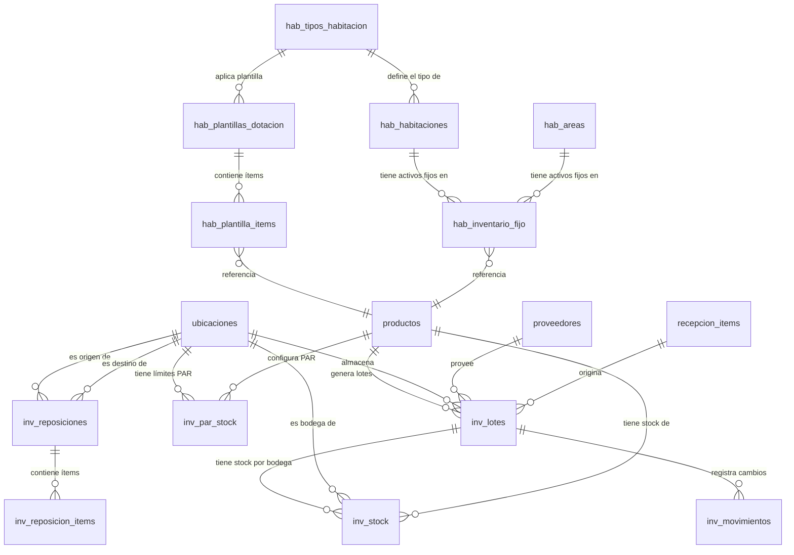

# Esquema de Base de Datos — Inventario v2.1

Este documento detalla el diseño físico-lógico completo de la base de datos del **Módulo de Inventario v2.1** del Hotel Bugambilias. Incluye todas las tablas activas, sus campos comentados, índices, restricciones y el orden correcto de migraciones.

> [!WARNING]
> **Las tablas `inv_modulos`, `inv_stock_ubicacion` e `inv_reservas` del v1 fueron eliminadas.** No deben ser referenciadas en código nuevo. Ver la sección de tablas eliminadas al final de este documento.

---

## 🗺️ Diagrama Relacional (v2.1)



---

## 📋 CAPA 1 — Espacios Físicos

### 1.1 `hab_tipos_habitacion`
Catálogo maestro de los tipos de habitación del hotel (Estándar, Suite, Deluxe, etc.). Cada tipo agrupa habitaciones con características similares y comparte la misma plantilla de dotación.

**Migración**: `2026_05_20_000001_create_hab_tipos_habitacion_table.php`
**Modelo**: `App\Models\Espacios\TipoHabitacion`

| Campo | Tipo | Nulo | Por Defecto | Descripción |
| :--- | :--- | :---: | :--- | :--- |
| **id** | `bigint UNSIGNED` | No | Auto | Clave primaria autoincremental |
| **codigo** | `varchar(20)` | No | — | Código corto único del tipo (ej: `STD`, `STE`, `DLX`). Único en la tabla. Generado manualmente por el operador |
| **nombre** | `varchar(100)` | No | — | Nombre descriptivo (ej: `Habitación Estándar`, `Suite Presidencial`) |
| **capacidad_max** | `tinyint` | No | — | Número máximo de huéspedes que puede alojar este tipo |
| **descripcion** | `text` | Sí | `NULL` | Descripción operativa y características del tipo de habitación |
| **activo** | `boolean` | No | `true` | Indica si el tipo está disponible para asignaciones nuevas |
| **created_at** | `timestamp` | Sí | `NULL` | Fecha de creación del registro |
| **updated_at** | `timestamp` | Sí | `NULL` | Fecha de última modificación |

**Índices**:
- `PRIMARY KEY (id)`
- `UNIQUE (codigo)` — Previene duplicados de código de tipo

---

### 1.2 `hab_habitaciones`
Registro de cada habitación física del hotel. Cada habitación pertenece a un tipo y opcionalmente referencia la bodega/almacén del piso que la abastece de consumibles.

**Migración**: `2026_05_20_000002_create_hab_habitaciones_table.php`
**Modelo**: `App\Models\Espacios\Habitacion`

| Campo | Tipo | Nulo | Por Defecto | Descripción |
| :--- | :--- | :---: | :--- | :--- |
| **id** | `bigint UNSIGNED` | No | Auto | Clave primaria autoincremental |
| **numero** | `varchar(20)` | No | — | Número o código de la habitación (ej: `101`, `201A`). Único en la tabla. Generado manualmente |
| **tipo_id** | `bigint UNSIGNED` | No | — | FK → `hab_tipos_habitacion`. Tipo al que pertenece (cascadeOnDelete) |
| **piso** | `tinyint` | No | — | Número de piso donde se ubica la habitación |
| **ubicacion_id** | `bigint UNSIGNED` | Sí | `NULL` | FK → `ubicaciones` (nullOnDelete). Bodega de piso que surte esta habitación de consumibles |
| **estado** | `varchar(20)` | No | `disponible` | Estado operativo: `disponible`, `ocupada`, `mantenimiento`, `fuera_servicio` |
| **activa** | `boolean` | No | `true` | Indica si la habitación está habilitada para operaciones |
| **created_at** | `timestamp` | Sí | `NULL` | Fecha de creación |
| **updated_at** | `timestamp` | Sí | `NULL` | Fecha de última modificación |

**Índices**:
- `PRIMARY KEY (id)`
- `UNIQUE (numero)` — Cada habitación tiene un número único en el hotel

---

### 1.3 `hab_areas`
Catálogo de áreas comunes, salones de eventos, restaurantes, spas y demás espacios compartidos del hotel que también pueden tener activos fijos asignados.

**Migración**: `2026_05_20_000003_create_hab_areas_table.php`
**Modelo**: `App\Models\Espacios\Area`

| Campo | Tipo | Nulo | Por Defecto | Descripción |
| :--- | :--- | :---: | :--- | :--- |
| **id** | `bigint UNSIGNED` | No | Auto | Clave primaria autoincremental |
| **codigo** | `varchar(20)` | No | — | Código único del área (ej: `REST-1`, `SPA`, `SALON-A`). Único en la tabla |
| **nombre** | `varchar(100)` | No | — | Nombre descriptivo del área |
| **tipo** | `varchar(30)` | No | — | Categoría del área: `salon`, `restaurante`, `area_comun`, `otro` |
| **capacidad** | `int` | Sí | `NULL` | Aforo máximo de personas (para salones de eventos) |
| **activa** | `boolean` | No | `true` | Indica si el área está habilitada para asignaciones |
| **created_at** | `timestamp` | Sí | `NULL` | Fecha de creación |
| **updated_at** | `timestamp` | Sí | `NULL` | Fecha de última modificación |

**Índices**:
- `PRIMARY KEY (id)`
- `UNIQUE (codigo)`

---

## 📋 CAPA 2 — Activos Fijos y Dotación

### 2.1 `hab_inventario_fijo`
Registra los **activos fijos** asignados permanentemente a habitaciones o áreas. Un activo fijo es cualquier bien que no se consume ni se retira en cada estadía: camas, televisores, aires acondicionados, refrigeradores, muebles, etc.

> **Regla de Negocio**: Los activos fijos nunca se rastrean en `inv_stock`. Viven en esta tabla y se gestionan mediante los casos de uso de Espacios.

**Migración**: `2026_05_20_000004_create_hab_inventario_fijo_table.php`
**Modelo**: `App\Models\Espacios\InventarioFijo`

| Campo | Tipo | Nulo | Por Defecto | Descripción |
| :--- | :--- | :---: | :--- | :--- |
| **id** | `bigint UNSIGNED` | No | Auto | Clave primaria autoincremental |
| **espacio_tipo** | `varchar(20)` | No | — | Tipo de espacio propietario: `habitacion` o `area`. Forma parte de la relación polimórfica simple |
| **espacio_id** | `bigint UNSIGNED` | No | — | ID del espacio propietario (habitación o área). Junto con `espacio_tipo` forma la relación |
| **producto_id** | `bigint UNSIGNED` | No | — | FK → `productos`. Producto/activo asignado (cascadeOnDelete) |
| **producto_variante_id** | `bigint UNSIGNED` | Sí | `NULL` | FK → `producto_variantes`. Variante específica del activo (nullOnDelete) |
| **cantidad** | `decimal(14,4)` | No | — | Cantidad de este activo asignada al espacio (ej: `2.0` sillas) |
| **estado** | `varchar(30)` | No | `operativo` | Estado del activo: `operativo`, `en_reparacion`, `dado_de_baja` |
| **notas** | `text` | Sí | `NULL` | Observaciones o notas sobre el estado del activo |
| **created_at** | `timestamp` | Sí | `NULL` | Fecha de asignación |
| **updated_at** | `timestamp` | Sí | `NULL` | Fecha de última modificación |
| **deleted_at** | `timestamp` | Sí | `NULL` | Borrado lógico (Soft Delete). Permite historial de activos retirados |

**Restricción Única**:
- `UNIQUE (espacio_tipo, espacio_id, producto_id, producto_variante_id)` — Solo puede haber una entrada por producto y espacio

---

### 2.2 `hab_plantillas_dotacion`
Define las **recetas de consumibles** que se deben preparar en una habitación o área. Cada plantilla describe qué productos consumibles se requieren y en qué cantidad.

**Migración**: `2026_05_20_000005_create_hab_plantillas_dotacion_table.php`
**Modelo**: `App\Models\Espacios\PlantillaDotacion`

| Campo | Tipo | Nulo | Por Defecto | Descripción |
| :--- | :--- | :---: | :--- | :--- |
| **id** | `bigint UNSIGNED` | No | Auto | Clave primaria autoincremental |
| **nombre** | `varchar(150)` | No | — | Nombre descriptivo de la plantilla (ej: `Dotación Estándar`, `Amenidades VIP`) |
| **espacio_tipo** | `varchar(20)` | No | — | Tipo de espacio al que aplica: `habitacion` o `area` |
| **tipo_id** | `bigint UNSIGNED` | Sí | `NULL` | FK sin constraint formal (nullOnDelete en lógica). ID del tipo de habitación que usa esta plantilla |
| **activa** | `boolean` | No | `true` | Solo las plantillas activas pueden aplicarse a través de `PrepararEspacio` |
| **notas** | `text` | Sí | `NULL` | Descripción extendida o instrucciones especiales para la preparación |
| **created_at** | `timestamp` | Sí | `NULL` | Fecha de creación |
| **updated_at** | `timestamp` | Sí | `NULL` | Fecha de última modificación |

---

### 2.3 `hab_plantilla_items`
Líneas de detalle de cada plantilla: qué producto, en qué cantidad y si se repone diariamente.

**Migración**: `2026_05_20_000005_create_hab_plantillas_dotacion_table.php` (misma migración)
**Modelo**: `App\Models\Espacios\PlantillaItem`

| Campo | Tipo | Nulo | Por Defecto | Descripción |
| :--- | :--- | :---: | :--- | :--- |
| **id** | `bigint UNSIGNED` | No | Auto | Clave primaria autoincremental |
| **plantilla_id** | `bigint UNSIGNED` | No | — | FK → `hab_plantillas_dotacion` (cascadeOnDelete) |
| **producto_id** | `bigint UNSIGNED` | No | — | FK → `productos`. Consumible requerido (cascadeOnDelete) |
| **producto_variante_id** | `bigint UNSIGNED` | Sí | `NULL` | FK → `producto_variantes`. Variante específica (nullOnDelete) |
| **cantidad** | `decimal(14,4)` | No | — | Cantidad del producto que se debe colocar por preparación |
| **es_reposicion_diaria** | `boolean` | No | `false` | Si `true`, el caso de uso `ReponerEspacio` incluirá este ítem en la reposición diaria automatizada |
| **created_at** | `timestamp` | Sí | `NULL` | Fecha de creación |
| **updated_at** | `timestamp` | Sí | `NULL` | Fecha de última modificación |

---

## 📋 CAPA 3 — Stock de Bodegas (Consumibles)

### 3.1 `inv_lotes`
Corazón operativo del control de inventario. Registra cada lote de mercancía recibida, su cantidad actual disponible y su fecha de vencimiento para la estrategia FEFO.

**Migración**: `2026_05_17_000002_create_inventarios_tables.php`
**Modelo**: `App\Models\Inventario\Lote`
**Factory**: `Database\Factories\Inventario\LoteFactory`

#### Generación del `codigo_lote`
El código del lote se genera automáticamente en `RegistrarEntradaRecepcion::execute()`:
```php
// Si el proveedor envió su propio número de lote, se usa ese.
// Si no, se genera automáticamente:
$codigoBase = $item['lote_proveedor']
    ?: sprintf('LOTE-%d-%s', $productoId, now()->format('Ymd'));

// Para recepciones con discrepancia, se agrega un sufijo:
// - Lote en estado Disponible: $codigoBase . '-DISP'
// - Lote en estado Cuarentena: $codigoBase . '-CUAR'
```

| Campo | Tipo | Nulo | Por Defecto | Descripción |
| :--- | :--- | :---: | :--- | :--- |
| **id** | `bigint UNSIGNED` | No | Auto | Clave primaria autoincremental |
| **codigo_lote** | `varchar(100)` | No | — | Código único del lote. Generado como `LOTE-{producto_id}-{Ymd}` o tomado del proveedor |
| **producto_id** | `bigint UNSIGNED` | No | — | FK → `productos` (cascadeOnDelete). Producto al que pertenece este lote |
| **producto_variante_id** | `bigint UNSIGNED` | Sí | `NULL` | FK → `producto_variantes` (nullOnDelete). Variante específica si aplica |
| **estado** | `tinyint / enum` | No | — | Estado del lote. Controlado por `App\Enums\Inventario\EstadoLote`: `Disponible`, `Cuarentena`, `Agotado`, `Vencido`, `Rechazado` |
| **cantidad_disponible** | `decimal(14,4)` | No | `0.0000` | Cantidad actual disponible para consumos. Se decrementa con cada consumo o traslado |
| **cantidad_inicial** | `decimal(14,4)` | No | `0.0000` | Cantidad original al momento de la recepción. No cambia después de la creación |
| **ubicacion_id** | `bigint UNSIGNED` | Sí | `NULL` | FK → `ubicaciones` (nullOnDelete). Almacén o bodega donde fue ubicado el lote inicialmente |
| **fecha_vencimiento** | `date` | Sí | `NULL` | Fecha de caducidad del lote. `NULL` para productos sin vencimiento. **Esencial para el algoritmo FEFO** |
| **lote_proveedor** | `varchar(100)` | Sí | `NULL` | Número de lote original del fabricante/proveedor. Permite trazabilidad con el proveedor |
| **proveedor_id** | `bigint UNSIGNED` | Sí | `NULL` | FK → `proveedores` (nullOnDelete). Proveedor del que se recibió este lote |
| **fecha_recepcion** | `date` | No | — | Fecha en que físicamente ingresó el lote al almacén del hotel |
| **recepcion_item_id** | `bigint UNSIGNED` | Sí | `NULL` | FK → `recepcion_items` (nullOnDelete). Ítem de recepción de compra que originó este lote |
| **created_at** | `timestamp` | Sí | `NULL` | Fecha de creación del registro |
| **updated_at** | `timestamp` | Sí | `NULL` | Fecha de última actualización |
| **deleted_at** | `timestamp` | Sí | `NULL` | Soft Delete. Lotes borrados lógicamente mantienen historial |

**Índices**:
- `inv_lotes_producto_id_estado_index (producto_id, estado)` — Agiliza búsquedas de lotes disponibles por producto (FEFO)
- `inv_lotes_estado_fecha_vencimiento_index (estado, fecha_vencimiento)` — Optimiza el barrido diario de caducidades (UC-04)

---

### 3.2 `inv_stock`
**Nueva tabla del v2.1.** Registra la existencia física de consumibles por producto, lote y bodega real. Reemplaza completamente a `inv_stock_ubicacion` del v1.

> **Principio fundamental**: Un registro en `inv_stock` existe solo mientras `cantidad > 0`. Cuando un consumo o traslado deja la cantidad en cero, el registro se elimina para mantener la tabla limpia.

**Migración**: `2026_05_20_000006_create_inv_stock_table.php`
**Modelo**: `App\Models\Inventario\Stock`

| Campo | Tipo | Nulo | Por Defecto | Descripción |
| :--- | :--- | :---: | :--- | :--- |
| **id** | `bigint UNSIGNED` | No | Auto | Clave primaria autoincremental |
| **producto_id** | `bigint UNSIGNED` | No | — | FK → `productos` (cascadeOnDelete). Producto del que se registra el stock |
| **producto_variante_id** | `bigint UNSIGNED` | Sí | `NULL` | FK → `producto_variantes` (nullOnDelete). Variante específica del producto |
| **lote_id** | `bigint UNSIGNED` | Sí | `NULL` | FK → `inv_lotes` (nullOnDelete). Lote al que pertenece esta existencia. Puede ser `NULL` para stock sin lote específico |
| **ubicacion_id** | `bigint UNSIGNED` | No | — | FK → `ubicaciones` (cascadeOnDelete). **Bodega física real donde está este stock**. Solo `tipo='almacen'` |
| **cantidad** | `decimal(14,4)` | No | `0.0000` | Cantidad disponible en esta bodega. Se elimina el registro cuando llega a cero |
| **created_at** | `timestamp` | Sí | `NULL` | Fecha de creación |
| **updated_at** | `timestamp` | Sí | `NULL` | Fecha de última modificación |

**Restricción Única**:
- `inv_stock_unique (producto_id, producto_variante_id, lote_id, ubicacion_id)` — Garantiza una sola fila por combinación de producto+variante+lote+bodega. Permite upserts seguros

**Índices**:
- `index (producto_id, ubicacion_id)` — Agiliza consultas de stock de un producto en una bodega específica

---

### 3.3 `inv_movimientos`
Bitácora histórica e inmutable de todas las transacciones de inventario. Cada cambio de stock debe registrar un movimiento aquí. Nunca se modifica ni se borra.

**Migración**: `2026_05_17_000002_create_inventarios_tables.php`
**Modelo**: `App\Models\Inventario\MovimientoStock`
**Factory**: `Database\Factories\Inventario\MovimientoStockFactory`

#### Tipos de Movimiento (`tipo`)

| Tipo | Descripción |
| :--- | :--- |
| `MOV_ENTRADA` | Ingreso de mercancía por recepción de compra |
| `TRASLADO` | Transferencia entre dos bodegas físicas |
| `SALIDA_DOTACION` | Consumo por preparación de habitación con plantilla |
| `REPOSICION_DIARIA` | Consumo por reposición diaria de amenidades |
| `DEVOLUCION_BODEGA` | Regreso de consumibles a la bodega de piso |
| `MOV_TRANSFERENCIA` | Traslado de cuarentena a almacén al liberar lote |
| `MOV_AJUSTE` | Ajuste de inventario por auditoría física |
| `AJUSTE_ENTRADA` | Excedente detectado en toma física de inventario |
| `AJUSTE_SALIDA` | Faltante detectado en toma física de inventario |
| `BAJA_CADUCIDAD` | Lote vencido enviado a merma automáticamente |
| `BAJA_CALIDAD` | Lote rechazado por inspección de calidad |
| `DEVOLUCION_PROVEEDOR` | Devolución de mercancía al proveedor |
| `CONSUMO` | Consumo general sin categoría específica |

| Campo | Tipo | Nulo | Por Defecto | Descripción |
| :--- | :--- | :---: | :--- | :--- |
| **id** | `bigint UNSIGNED` | No | Auto | Clave primaria autoincremental |
| **tipo** | `varchar(40)` | No | — | Tipo de movimiento. Ver tabla de tipos arriba |
| **lote_id** | `bigint UNSIGNED` | Sí | `NULL` | FK → `inv_lotes` (nullOnDelete). Lote involucrado en el movimiento |
| **producto_id** | `bigint UNSIGNED` | No | — | FK → `productos` (cascadeOnDelete). Producto del movimiento |
| **cantidad** | `decimal(14,4)` | No | — | Cantidad transaccionada. **Negativa para salidas**, positiva para entradas |
| **ubicacion_origen_id** | `bigint UNSIGNED` | Sí | `NULL` | FK → `ubicaciones`. Bodega de origen. `NULL` si es ingreso externo |
| **ubicacion_destino_id** | `bigint UNSIGNED` | Sí | `NULL` | FK → `ubicaciones`. Bodega de destino. `NULL` si es salida/consumo final |
| **documento_tipo** | `varchar(50)` | Sí | `NULL` | Tipo de documento soporte (ej: `recepcion_item`, `reposicion`, `devolucion`) |
| **documento_id** | `bigint UNSIGNED` | Sí | `NULL` | ID del documento soporte de este movimiento |
| **referencia** | `varchar(255)` | Sí | `NULL` | Glosa descriptiva del movimiento (ej: `"Lote LOTE-5-20260520 — Disponible"`) |
| **creado_por_id** | `bigint UNSIGNED` | Sí | `NULL` | FK → `users` (nullOnDelete). Usuario responsable del movimiento |
| **notas** | `text` | Sí | `NULL` | Observaciones adicionales o motivo del movimiento |
| **created_at** | `timestamp` | No | `useCurrent()` | Marca de tiempo inmutable del movimiento. No tiene `updated_at` |

> [!NOTE]
> El modelo tiene `public $timestamps = false` y `created_at` está en `$fillable`. Esto permite establecer la fecha de creación manualmente en importaciones o migraciones de datos, pero en uso normal se establece automáticamente.

**Índices**:
- `inv_movimientos_producto_id_created_at_index (producto_id, created_at)` — Para reportes de rotación e historial de consumo

---

### 3.4 `inv_par_stock`
Define los límites mínimos y objetivos de stock para cada producto en cada bodega real. Cuando el stock cae por debajo del mínimo, `GenerarReposicionesBodega` genera automáticamente una orden de reposición.

**Migración**: `2026_05_20_000007_modify_inv_par_stock_table.php` (recrea la tabla desde cero)
**Modelo**: `App\Models\Inventario\ParStock`

#### Cambio Clave del v1 al v2.1
En el v1, `inv_par_stock` usaba un campo polimórfico `ambito` + `ambito_id` para apuntar a habitaciones, salones, módulos o ubicaciones. En el v2.1, usa directamente `ubicacion_id` apuntando a una **bodega física real**.

| Campo | Tipo | Nulo | Por Defecto | Descripción |
| :--- | :--- | :---: | :--- | :--- |
| **id** | `bigint UNSIGNED` | No | Auto | Clave primaria autoincremental |
| **producto_id** | `bigint UNSIGNED` | No | — | FK → `productos` (cascadeOnDelete). Producto al que aplica esta regla PAR |
| **producto_variante_id** | `bigint UNSIGNED` | Sí | `NULL` | FK → `producto_variantes` (nullOnDelete). Variante específica. Si es `NULL`, aplica a todas las variantes |
| **ubicacion_id** | `bigint UNSIGNED` | No | — | FK → `ubicaciones` (cascadeOnDelete). **Bodega real** donde se controla el PAR Stock (tipo `almacen`) |
| **stock_minimo** | `decimal(14,4)` | No | `0.0000` | Nivel mínimo tolerable. Al caer por debajo de este valor se genera una orden de reposición |
| **stock_objetivo** | `decimal(14,4)` | No | `0.0000` | Nivel objetivo de reabastecimiento. Se repone hasta este nivel |
| **created_at** | `timestamp` | Sí | `NULL` | Fecha de creación |
| **updated_at** | `timestamp` | Sí | `NULL` | Fecha de última modificación |

**Restricción Única**:
- `inv_par_stock_unique (producto_id, producto_variante_id, ubicacion_id)` — Una sola regla PAR por producto+variante+bodega

---

### 3.5 `inv_reposiciones`
Cabecera de las órdenes de reabastecimiento entre bodegas. Registra el origen (bodega que surte), el destino (bodega que recibe) y el estado de la orden.

**Migración**: `2026_05_20_000008_modify_inv_reposiciones_table.php` (recrea la tabla desde cero)
**Modelo**: `App\Models\Inventario\Reposicion`

#### Cambio Clave del v1 al v2.1
En el v1, `inv_reposiciones` usaba `ambito` + `ambito_id` polimórfico para el destino. En el v2.1 usa `origen_id` y `destino_id` explícitos apuntando a bodegas reales.

#### Generación del `codigo`
El código se genera automáticamente en `GenerarReposicionesBodega::execute()`:
```php
$codigo = 'REP-' . now()->format('Ymd') . '-' . str_pad((string)rand(1, 9999), 4, '0', STR_PAD_LEFT);
// Ejemplo: REP-20260520-0042
```

| Campo | Tipo | Nulo | Por Defecto | Descripción |
| :--- | :--- | :---: | :--- | :--- |
| **id** | `bigint UNSIGNED` | No | Auto | Clave primaria autoincremental |
| **codigo** | `varchar(30)` | No | — | Folio único de la orden. Formato `REP-{Ymd}-{NNNN}`. Generado automáticamente |
| **origen_id** | `bigint UNSIGNED` | No | — | FK → `ubicaciones` (cascadeOnDelete). Bodega que surte el stock (generalmente el Almacén General) |
| **destino_id** | `bigint UNSIGNED` | No | — | FK → `ubicaciones` (cascadeOnDelete). Bodega que recibe el stock (ej: Bodega Piso 1) |
| **estado** | `varchar(20)` | No | `pendiente` | Estado del ciclo de vida: `pendiente`, `procesada`, `cancelada` |
| **creado_por_id** | `bigint UNSIGNED` | Sí | `NULL` | FK → `users` (nullOnDelete). Usuario o proceso que generó la orden |
| **procesado_por_id** | `bigint UNSIGNED` | Sí | `NULL` | FK → `users` (nullOnDelete). Usuario que autorizó y ejecutó el surtido |
| **fecha_proceso** | `timestamp` | Sí | `NULL` | Fecha y hora en que se procesó físicamente la reposición |
| **notas** | `text` | Sí | `NULL` | Observaciones o comentarios de la orden |
| **created_at** | `timestamp` | Sí | `NULL` | Fecha de creación |
| **updated_at** | `timestamp` | Sí | `NULL` | Fecha de última modificación |
| **deleted_at** | `timestamp` | Sí | `NULL` | Soft Delete |

**Índices**:
- `index (estado)` — Filtra rápidamente las órdenes pendientes en el panel Filament

---

### 3.6 `inv_reposicion_items`
Líneas de detalle de cada orden de reposición: qué producto se solicita, cuánto se pidió y cuánto se surtió efectivamente.

**Migración**: `2026_05_20_000008_modify_inv_reposiciones_table.php` (misma migración)
**Modelo**: `App\Models\Inventario\ReposicionItem`

| Campo | Tipo | Nulo | Por Defecto | Descripción |
| :--- | :--- | :---: | :--- | :--- |
| **id** | `bigint UNSIGNED` | No | Auto | Clave primaria autoincremental |
| **reposicion_id** | `bigint UNSIGNED` | No | — | FK → `inv_reposiciones` (cascadeOnDelete). Orden de reposición cabecera |
| **producto_id** | `bigint UNSIGNED` | No | — | FK → `productos` (cascadeOnDelete). Producto a reabastecer |
| **producto_variante_id** | `bigint UNSIGNED` | Sí | `NULL` | FK → `producto_variantes` (nullOnDelete). Variante específica |
| **cantidad_solicitada** | `decimal(14,4)` | No | — | Cantidad calculada por `GenerarReposicionesBodega` para alcanzar el stock objetivo |
| **cantidad_surtida** | `decimal(14,4)` | No | `0.0000` | Cantidad efectivamente surtida al procesar la reposición. Puede diferir de la solicitada si hay stock insuficiente en el origen |
| **created_at** | `timestamp` | Sí | `NULL` | Fecha de creación |
| **updated_at** | `timestamp` | Sí | `NULL` | Fecha de última modificación |

---

### 3.7 `inv_inventarios_fisicos`
Registro de las tomas periódicas de inventario físico para auditorías y corrección de discrepancias entre el stock lógico y el real.

**Migración**: `2026_05_18_000003_create_inventarios_fisicos_table.php`
**Modelo**: `App\Models\Inventario\InventarioFisico`

#### Generación del `codigo`
El código del inventario físico se genera manualmente por el operador o mediante el formulario de Filament, siguiendo el formato sugerido `INV-FIS-{Ymd}`.

| Campo | Tipo | Nulo | Por Defecto | Descripción |
| :--- | :--- | :---: | :--- | :--- |
| **id** | `bigint UNSIGNED` | No | Auto | Clave primaria autoincremental |
| **codigo** | `varchar(100)` | No | — | Folio único de control de la auditoría (ej: `INV-FIS-20260520`) |
| **fecha_toma** | `date` | No | — | Fecha en que se realizó el conteo físico |
| **estado** | `varchar(40)` | No | `borrador` | Estado: `borrador` (editable) o `procesado` (bloqueado, ajustes aplicados) |
| **creado_por_id** | `bigint UNSIGNED` | Sí | `NULL` | FK → `users` (nullOnDelete). Auditor responsable |
| **observaciones** | `text` | Sí | `NULL` | Notas del auditor sobre el conteo |
| **datos_hoja** | `longtext` | Sí | `NULL` | JSON con los conteos físicos capturados: `[{lote_id, cantidad_contada}]` |
| **created_at** | `timestamp` | Sí | `NULL` | Fecha de creación |
| **updated_at** | `timestamp` | Sí | `NULL` | Fecha de última modificación |
| **deleted_at** | `timestamp` | Sí | `NULL` | Soft Delete |

---

## 🗓️ Orden de Migraciones

El orden de aplicación es crítico por las dependencias de llaves foráneas:

```
PREEXISTENTES (deben existir antes del módulo de inventario):
  ├── ubicaciones          (2026_05_06_182350)   → tabla base para almacenes/bodegas
  ├── productos            (2026_05_10_080909)   → catálogo de productos
  ├── producto_variantes   (2026_05_10_231842)   → variantes de productos
  └── recepciones_compra   (2026_05_12_000006)   → recepciones del módulo de compras

INVENTARIO — NÚCLEO:
  ├── inv_lotes + inv_movimientos    (2026_05_17_000002)
  └── inv_inventarios_fisicos        (2026_05_18_000003)

ESPACIOS FÍSICOS (nuevo v2.1):
  ├── hab_tipos_habitacion           (2026_05_20_000001)
  ├── hab_habitaciones               (2026_05_20_000002)
  ├── hab_areas                      (2026_05_20_000003)
  ├── hab_inventario_fijo            (2026_05_20_000004)
  └── hab_plantillas_dotacion +
      hab_plantilla_items            (2026_05_20_000005)

STOCK DE BODEGAS (nuevo v2.1):
  └── inv_stock                      (2026_05_20_000006)

RECONSTRUCCIÓN v1 → v2.1:
  ├── DROP inv_reservas, inv_stock_ubicacion, inv_modulos
  ├── DROP + CREATE inv_par_stock    (2026_05_20_000007)
  └── DROP + CREATE inv_reposiciones +
      inv_reposicion_items           (2026_05_20_000008)
```

---

## 🌱 Seeders y Orden de Inicialización

```bash
# Orden de ejecución requerido por dependencias
php artisan migrate:fresh --seed

# O manualmente por seeder:
php artisan db:seed --class=Database\\Seeders\\UbicacionSeeder    # 1. Crea Almacén General (tipo='almacen')
php artisan db:seed --class=Database\\Seeders\\ProductoSeeder     # 2. Productos del hotel
php artisan db:seed --class=Database\\Seeders\\ProveedorSeeder    # 3. Proveedores de suministros
php artisan db:seed --class=Database\\Seeders\\InventarioSeeder   # 4. Lotes y stock inicial
```

### `UbicacionSeeder`
Inserta la ubicación raíz del almacén:
```php
Ubicacion::create([
    'nombre' => 'Almacén General',
    'tipo'   => 'almacen',   // ← Clave: PutawayPolicy busca tipo='almacen'
    'estado' => 1,           // ← Activo
]);
```
> [!IMPORTANT]
> El **Almacén General** debe tener `tipo = 'almacen'` y `estado = 1`. `PutawayPolicy` busca específicamente esta configuración para asignar inventario recibido.

### `InventarioSeeder`
Genera lotes iniciales de stock del hotel vinculados al Almacén General, registrando los movimientos de `MOV_ENTRADA` correspondientes y poblando `inv_stock` con las existencias iniciales.

---

## ❌ Tablas Eliminadas (v1 — NO USAR)

Las siguientes tablas existieron en el v1 y fueron eliminadas en la migración `2026_05_20_000007`. **No deben ser referenciadas en ningún código nuevo.**

| Tabla | Por qué existía | Por qué se eliminó |
| :--- | :--- | :--- |
| **`inv_modulos`** | Sub-almacenes polimórficos (minibares, carritos) ligados a habitaciones/salones | Concepto erróneo: mezclaba camas, TVs y champús en el mismo modelo |
| **`inv_stock_ubicacion`** | Distribución física de stock con campo `ambito` (`H`, `S`, `U`, `M`) | Reemplazado por `inv_stock` que solo usa bodegas reales (`ubicaciones` tipo `almacen`) |
| **`inv_reservas`** | Aislamiento temporal de stock para prevenir consumos concurrentes | El nuevo flujo de dotación por plantilla elimina la necesidad de reservas temporales |
