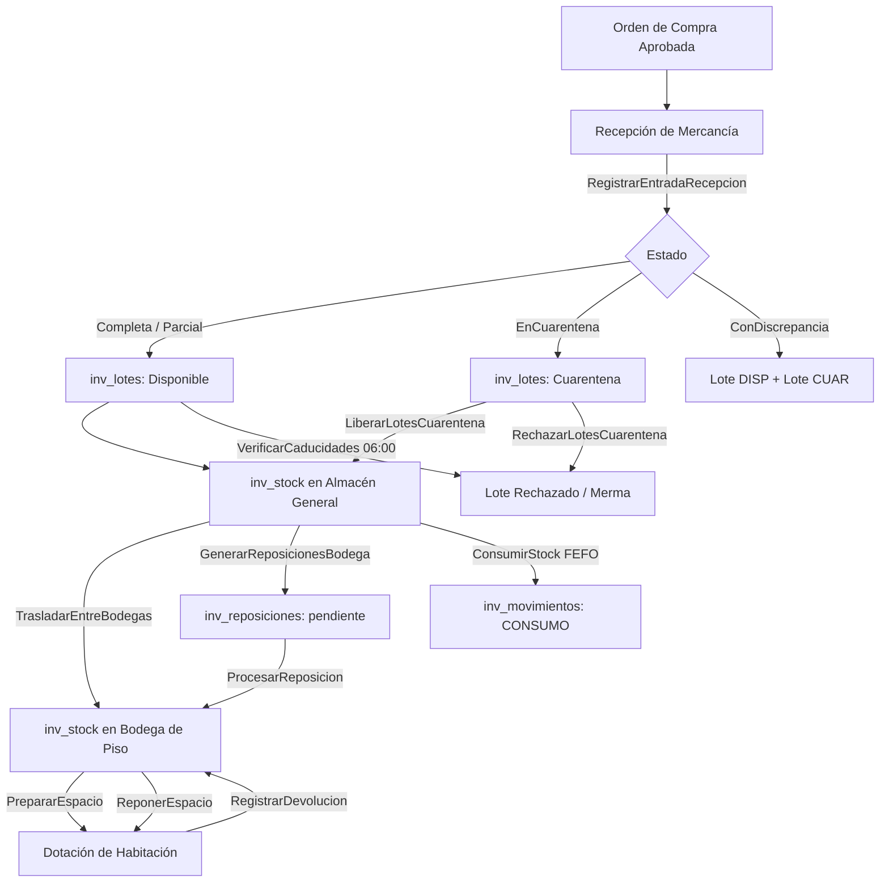

# Sistema de Inventario v2.1 — Hotel Bugambilias

Bienvenido a la documentación maestra del **Módulo de Inventario v2.1** de la plataforma del Hotel Bugambilias (Laravel 13 + Filament v5).

Este módulo fue rediseñado por completo en la versión 2.1 para corregir el error conceptual del v1, que mezclaba activos fijos y consumibles en un único modelo polimórfico (`inv_stock_ubicacion` + `inv_modulos`). En la versión actual, el sistema opera bajo una **arquitectura de tres capas limpias y desacopladas**.

> [!IMPORTANT]
> **El módulo de Inventario es autónomo.** No tiene llaves foráneas hacia Reservas ni hacia Huéspedes. El módulo de Reservas consume sus servicios mediante eventos o llamadas directas, nunca al revés.

---

## ⚠️ Tablas y Archivos Eliminados (v1 → v2.1)

Los siguientes elementos del diseño v1 fueron declarados obsoletos y eliminados con la migración `2026_05_20_000007_modify_inv_par_stock_table.php`:

| Tabla Eliminada | Razón |
| :--- | :--- |
| `inv_modulos` | Concepto erróneo: mezclaba minibares, salones y bodegas en un solo modelo polimórfico |
| `inv_stock_ubicacion` | Reemplazada por `inv_stock`, que solo rastrea consumibles en bodegas físicas reales |
| `inv_reservas` | Reservas temporales de stock no alineadas con el nuevo flujo de dotación por plantilla |

| Modelo PHP Eliminado | Razón |
| :--- | :--- |
| `App\Models\Inventario\Modulo` | Entidad del v1 ya sin tabla de soporte |
| `App\Models\Inventario\StockUbicacion` | Reemplazado por `App\Models\Inventario\Stock` |
| `App\Models\Inventario\Reserva` | Concepto desactivado del v1 |

| Recurso Filament Eliminado | Razón |
| :--- | :--- |
| `ModuloResource` | Sin tabla soporte |
| `StockUbicacionResource` | Reemplazado por `StockResource` |

---

## 🏗️ Arquitectura: Las Tres Capas

```
┌──────────────────────────────────────────────────────────┐
│  CAPA 1 — ESPACIOS FÍSICOS                               │
│  hab_tipos_habitacion, hab_habitaciones, hab_areas       │
│  ¿Qué espacios existen en el hotel?                      │
└──────────────────────────────────────────────────────────┘
            │ pertenece / referencia
            ▼
┌──────────────────────────────────────────────────────────┐
│  CAPA 2 — ACTIVOS FIJOS Y DOTACIÓN                       │
│  hab_inventario_fijo                                     │
│  → Camas, TV, A/C, muebles: nunca salen del espacio      │
│                                                          │
│  hab_plantillas_dotacion + hab_plantilla_items           │
│  → Recetas de consumibles por tipo de habitación         │
└──────────────────────────────────────────────────────────┘
            │ consume desde
            ▼
┌──────────────────────────────────────────────────────────┐
│  CAPA 3 — STOCK DE BODEGAS (Consumibles)                 │
│  inv_lotes, inv_stock, inv_movimientos                   │
│  → Solo en ubicaciones físicas tipo 'almacen'            │
│  inv_par_stock, inv_reposiciones, inv_reposicion_items   │
│  → Configuración y ejecución de reabastecimiento         │
└──────────────────────────────────────────────────────────┘
```

---

## 🧭 Índice de Documentación

1. [**BASE_DATOS.md**](./BASE_DATOS.md) — Esquema completo de tablas, campos, índices y restricciones
2. [**CASOS_USO.md**](./CASOS_USO.md) — Catálogo de todos los casos de uso con firmas y lógica
3. [**FUNCIONALIDADES.md**](./FUNCIONALIDADES.md) — Algoritmos clave: FEFO, PutawayPolicy, PAR Stock, Dotación

---

## 🔄 Ciclo de Vida del Producto (v2.1)



---

## 🛡️ Principios de Diseño

- **Desacoplamiento**: El inventario no conoce Reservas ni Huéspedes
- **Trazabilidad Total**: Cada cambio de stock produce un registro en `inv_movimientos`
- **Estrategia FEFO**: Consumo siempre priorizando fecha de vencimiento más próxima
- **Un almacén real**: El stock consumible solo vive en `ubicaciones` de `tipo='almacen'`
- **Activos ≠ Consumibles**: Camas y TVs van a `hab_inventario_fijo`; champús y agua van a `inv_stock`

---

*Hotel Bugambilias — Módulo de Inventario v2.1*
